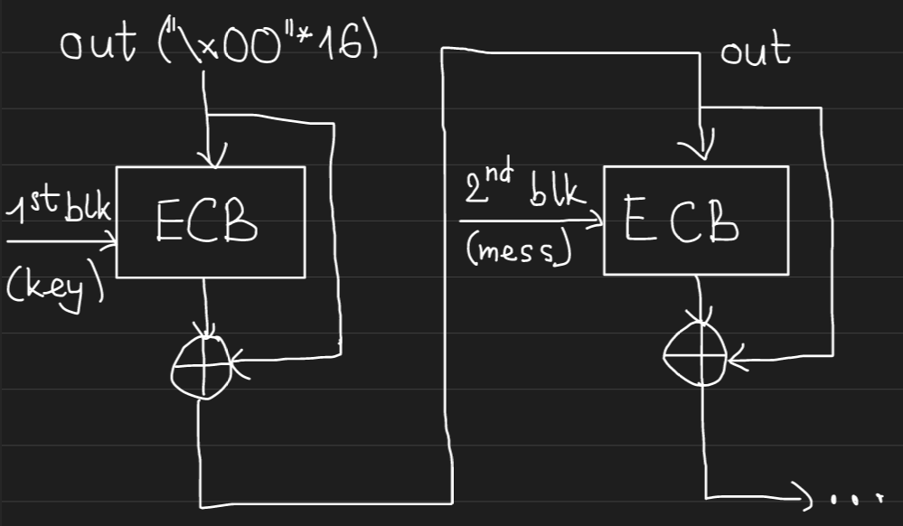
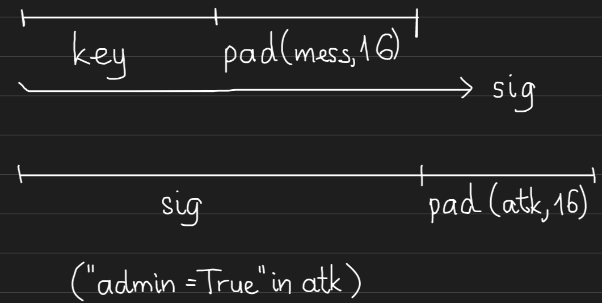

+++
title = "CryptoHack - Hash Functions"
date = 2023-08-14
description = "Giải các bài tập về hàm băm (Hash Functions) trên CryptoHack, bao gồm Jack's Birthday, MD5 collisions và Length Extension Attack."
[taxonomies]
tags = ["ctf", "cryptohack", "crypto", "hash", "md5", "length-extension", "collison"]
[extra]
toc = true
+++

Series giải các bài tập về **Hash Functions** trên CryptoHack.

**Author**: Nguyễn Chí Thành | JakeClark  
**Date**: Mon, Aug 14th, 2023

<!-- more -->

## Jack’s Birthday Hash

Với hàm băm `JACK11()` vì giá trị của nó là 1 dãy nhị phân có 11 bit, nên nó sẽ có $2^{11}$ giá trị khác nhau.

Xác suất lấy 1 giá trị trong số $2^{11}$ giá trị đó là $\frac{1}{H}$, với $H$ trong trường hợp này là $2^{11}$, vì vậy xác suất không lấy được 1 giá trị trong số $H$ giá trị là $1-\frac{1}{H}$, và xác suất không lấy được $n$ giá trị (có thể giống hoặc khác nhau) trong số $H$ giá trị là $(1-\frac{1}{H})^{n}$.

Gọi $P(n)$ là xác suất lấy được $n$ giá trị (có thể giống hoặc khác nhau) trong số $H$ giá trị có ít nhất 1 giá trị đụng độ, và $P'(n)$ là xác suất không lấy được $n$ giá trị. Dựa vào trên, ta có thể tính:

$$
P(n)=1-P'(n)=1-(1-\frac{1}{H})^{n}
$$

Theo đề bài, ta cần tìm $n$ sao cho $P(n) \ge 50\%$. Thế vào công thức trên, ta có:

$$
1-(1-\frac{1}{H})^{n} \ge 50\%
$$

Chuyển vế, lấy logarit ta có:

$$
n = \log_{\frac{1}{2}}{(1-\frac{1}{H})} = \frac{\ln{\frac{1}{2}}}{\ln{(1-\frac{1}{H})}} \approx 1419.22
$$

Vậy kết quả là **1420**.

## Jack’s Birthday Confusion

Gọi $P(n)$ là xác suất lấy được $n$ giá trị trong số $H$ giá trị có ít nhất 1 giá trị đụng độ, $n$ giá trị này phải khác nhau, và $P'(n)$ là xác suất không lấy được $n$ giá trị với $P(n)=1-P'(n)$. Với $P'(n)$, ta có thể tính bằng $\frac{H}{H} \cdot \frac{H-1}{H} \cdot \frac{H-2}{H} \dots \frac{H-n+1}{H}$.

Vì vậy, theo đề thì ta cần tìm $n$ sao cho $P(n) \ge 75\%$ nên ta có:

$$
P(n)=1 - \left( \frac{H}{H} \cdot \frac{H-1}{H} \cdot \frac{H-2}{H} \dots \frac{H-n+1}{H} \right) \ge 75\%
$$

Sau khi xấp xỉ $P(n)$:

$$
P(n)=1-e^{-\frac{n^2}{2H}}
$$

Ta có thể tính $n$ bằng công thức:

$$
n = \sqrt{2H \ln(\frac{1}{1-0.75})}
$$

Vậy kết quả là **75**.

## Collider

Đối với bài này, ta nhận thấy điểm yếu của bài này là sử dụng MD5 để băm document, vì vậy ta cần đưa ra cho nó 2 document khác nhau nhưng cùng giá trị hash. 

Ở đây ta sẽ sử dụng tool từ **HashClash** để tạo ra 2 file khác nội dung nhưng cùng giá trị hash.

Đầu tiên ta sẽ chèn prefix cần có trong nội dung 2 file vào file `prefix.txt`:

```bash
echo -n "aaaa" > prefix.txt
```

Sau đó ta khởi chạy script `poc_no.sh` trong thư mục script, trong trường hợp này cây thư mục gồm:

```text
hashclash
|---cpc_workdir
|   |--- prefix.txt
|---scripts
    |--- poc_no.sh
```

Thì lệnh sẽ là:

```bash
../scripts/poc_no.sh prefix.txt
```

Sau khi chạy xong nó sẽ tạo 2 file, `collision1.bin` và `collision2.bin` trong thư mục `cpc_workdir`, để chuyển đổi thành dạng hex đưa vào server ta dùng:

```bash
xxd -p collision1.bin
# 61616161c8e1a15b18ce694a9a8600a4469572661898abb4dd3ff30419438a27ddeb313be505ebc9c7c41d41b3335718cc1b5b40d0fcdd2d44813310d0a2789ffcdac846fabb2edb83a45e8f3421d5b94748ce85fc03d2e4dac603d373d0fd9eecf6d0c8770b4cd41915194c4a9cb3ade061a780ab23fbc098d067b318e66f64

xxd -p collision2.bin
# 61616161c8e1a15b18cf694a9a8600a4469572661898abb4dd3ff30419438a27ddeb313be505ebc9c7c41d41b3335718cc1b5b40d0fcdd2d44813310d0a2789ffcdac846fabb2edb83a35e8f3421d5b94748ce85fc03d2e4dac603d373d0fd9eecf6d0c8770b4cd41915194c4a9cb3ade061a780ab23fbc098d067b318e66f64
```

Sau đó ta đưa vào server lần lượt:

```json
{"document": "61616161c8e1a15b18ce694a9a8600a4469572661898abb4dd3ff30419438a27ddeb313be505ebc9c7c41d41b3335718cc1b5b40d0fcdd2d44813310d0a2789ffcdac846fabb2edb83a45e8f3421d5b94748ce85fc03d2e4dac603d373d0fd9eecf6d0c8770b4cd41915194c4a9cb3ade061a780ab23fbc098d067b318e66f64"}
{"document": "61616161c8e1a15b18cf694a9a8600a4469572661898abb4dd3ff30419438a27ddeb313be505ebc9c7c41d41b3335718cc1b5b40d0fcdd2d44813310d0a2789ffcdac846fabb2edb83a35e8f3421d5b94748ce85fc03d2e4dac603d373d0fd9eecf6d0c8770b4cd41915194c4a9cb3ade061a780ab23fbc098d067b318e66f64"}
```

## Hash Stuffing

Đối với bài này ta có 1 hàm băm riêng, tuy nhiên lỗ hổng là ở chỗ padding, khi chuỗi msg đã đủ 64 byte nó không chèn gì thêm như những thuật toán padding khác:

```python
def pad(data):
    padding_len = (BLOCK_SIZE - len(data)) % BLOCK_SIZE
    return data + bytes([padding_len]*padding_len)
```

Chính vì vậy ta có thể đưa cho nó 2 chuỗi, 1 chuỗi chưa padding và 1 chuỗi đã padding theo cách trên, theo lý thuyết 2 chuỗi này khác nhau nhưng cùng mã băm. 

**Script**:

```python
import json
from pwn import remote
BLOCK_SIZE = 32

def pad(data):
    padding_len = (BLOCK_SIZE - len(data)) % BLOCK_SIZE
    return data + bytes([padding_len]*padding_len)

io: remote = remote("socket.cryptohack.org", 13405)
try:
    io.recvuntil(b"JSON: ")
    io.sendline(json.dumps({"m1": (b"1"*63).hex(), "m2": pad(b"1"*63).hex()}).encode())
    print(json.dumps({"m1": (b"1"*63).hex(), "m2": pad(b"1"*63).hex()}))
    resp = io.recvline()
    print(resp)
finally:
    io.close()
```

## PriMeD5

Đối với bài này, 1 lần nữa ta thấy ở phần ký:

```python
elif msg["option"] == "sign":
		p = int(msg["prime"])
		if p.bit_length() > 1024:
		    return {"error": "The prime is too large."}
		if not isPrime(p):
		    return {"error": "You must specify a prime."}
		
		hash = MD5.new(long_to_bytes(p))
		sig = sig_scheme.sign(hash)
		return {"signature": sig.hex()}
```

Nó chỉ đưa vào giá trị MD5 của số nguyên tố $p$ vào hàm ký, vì vậy đây là lỗ hổng thứ nhất.

Ở phần xác nhận chữ ký:

```python
elif msg["option"] == "check":
    p = int(msg["prime"])
    sig = bytes.fromhex(msg["signature"])
    hash = MD5.new(long_to_bytes(p))
    try:
        sig_scheme.verify(hash, sig)
    except ValueError:
        return {"error": "Invalid signature."}
    a = int(msg["a"])
    if a < 1:
        return {"error": "`a` value invalid"}
    if a >= p:
        return {"error": "`a` value too large"}
    g = math.gcd(a, p)
    flag_byte = FLAG[:g]
    return {"msg": f"Valid signature. First byte of flag: {flag_byte}"}
```

Nếu đúng như trên thì: $p$ đưa vào là 1 số nguyên tố thì bất kỳ $a$ nào bé hơn $p$ đều có $gcd(a, p)=1$, tuy nhiên lỗ hổng ở đây là không xác thực $p$ có phải là số nguyên tố hay không. Vì vậy ta sẽ cần tìm:

- 1 số nguyên tố $p1$ để ký.
- 1 số không phải nguyên tố $p2$ để xác thực sao cho $md5(p1) = md5(p2)$ và đủ lớn.
- 1 số $a$ sao cho $gcd(p', a) \ge 30$, số 30 này là 1 số ước chừng vì trong Python, nếu ta dùng `FLAG[:g]` với $g \ge len(FLAG)$ thì chương trình vẫn in hết chuỗi $FLAG$.

1 tính chất của hàm băm là nếu $hash(p1) = hash(p2)$ thì với bất kỳ chuỗi $c$ nào, ta luôn có $hash(p1||c) = hash(p2||c)$ với “||” là phép nối 2 chuỗi lại với nhau.

Vì vậy ta dùng phương pháp brute-force để tìm một giá trị $c$ sao cho khi đổi 2 chuỗi bytes $p1||c$ và $p2||c$ thành số, ta nhận được 1 số nguyên tố và 1 số không phải nguyên tố.

Sau đó ta tiếp tục brute-force $a$ để thỏa điều kiện $gcd(p', a) \ge 30$.

Ở đây ta sẽ không dùng lại 2 chuỗi từ bài Collider để đưa vào $p1$ và $p2$ vì trông có vẻ rất lớn nên ta sẽ dùng 2 chuỗi khác để thay thế.

**Script**:

```python
from Crypto.Util.number import isPrime, bytes_to_long, long_to_bytes
import hashlib
from math import gcd

p1_hex = "0e306561559aa787d00bc6f70bbdfe3404cf03659e704f8534c00ffb659c4c8740cc942feb2da115a3f4155cbb8607497386656d7d1f34a42059d78f5a8dd1ef"
p2_hex = "0e306561559aa787d00bc6f70bbdfe3404cf03659e744f8534c00ffb659c4c8740cc942feb2da115a3f415dcbb8607497386656d7d1f34a42059d78f5a8dd1ef"

p1_num = bytes_to_long(bytes.fromhex(p1_hex))
p2_num = bytes_to_long(bytes.fromhex(p2_hex))

print("p1: ", p1_num)
print("md5(p1): ", hashlib.md5(bytes.fromhex(p1_hex)).hexdigest())
print("md5(p2): ", hashlib.md5(bytes.fromhex(p2_hex)).hexdigest())

c = 1
p1_plus_c = 0
p2_plus_c = 0

while True:
    # append 1s until prime
    p1_plus_c = bytes_to_long(bytes.fromhex(p1_hex) + long_to_bytes(c))
    p2_plus_c = bytes_to_long(bytes.fromhex(p2_hex) + long_to_bytes(c))
    if isPrime(p1_plus_c) and not isPrime(p2_plus_c):
        break
    c += 2

print("Prime:", p1_plus_c, p1_plus_c.bit_length())
print("Not Prime:", p2_plus_c, p2_plus_c.bit_length())

print("md5(Prime): ", hashlib.md5(long_to_bytes(p1_plus_c)).hexdigest())
print("md5(Not Prime): ", hashlib.md5(long_to_bytes(p2_plus_c)).hexdigest())

for i in range(20, 1_000_000):
    if gcd(p2_plus_c, i) >= 20:
        a = i
        print("a = ", i)
        break
```

Sau khi có được 3 giá trị `p1_plus_c`, `p2_plus_c` và `a`, ta đưa chúng vào trong server:

```python
from pwn import remote
import json

io: remote = remote("socket.cryptohack.org", 13392)
try:
    io.recvline()
    data = {"option": "sign", "prime": p1_plus_c}
    io.sendline(json.dumps(data).encode())
    resp = io.recvline()
    sig = json.loads(resp[:-1])["signature"]
    data = {"option": "check", "prime": p2_plus_c, "signature": sig, "a": a}
    io.sendline(json.dumps(data).encode())
    resp = io.recvline()
    print(resp)
finally:
    io.close()
```

## MD0

Nếu ta phân tích hàm băm của challenge:

```python
def hash(data: bytes) -> bytes:
    data = pad(data, 16)
    out = b"\x00" * 16
    for i in range(0, len(data), 16):
        blk = data[i:i+16]
        out = bxor(AES.new(blk, AES.MODE_ECB).encrypt(out), out)
    return out
```

Khái quát cách hàm hoạt động:



Vì vậy cấu trúc gần giống cấu trúc Merkle–Damgård, và chương trình không xác thực nội dung trong message, nên ta có thể sử dụng length extension attack để tạo ra 1 chuỗi message khác với mã hash khác mà không cần biết nội dung của key.

Mã hash trả về sau khi ký xong bao gồm chuỗi key nối với message đã được padding, vì vậy ta có thể nối dài chuỗi message như sau:



Đó chính là ý tưởng của code tấn công:

```python
from Crypto.Cipher import AES
from Crypto.Util.Padding import pad
from pwn import remote
import json

def bxor(a, b):
    return bytes(x ^ y for x, y in zip(a, b))

def main():
    io: remote = remote("socket.cryptohack.org", 13388)
    try:
        io.recvline()
        io.sendline('{"option": "sign", "message": "11"}'.encode())
        io.recvuntil(b'": "')
        resp: bytes = io.recvuntil(b'"')
        io.recvline()

        # Start length extension attack
        print(str(resp[:-1].decode())) # Remove "\n" at tail.
        out: bytes = bytes.fromhex(str(resp[:-1].decode()))
        # hex of "admin=True": 61 64 6d 69 6e 3d 54 72 75 65
        data: bytes = pad(bytes.fromhex("61646d696e3d54727565"), 16)
        for i in range(0, len(data), 16):
            blk = data[i:i+16]
            out = bxor(AES.new(blk, AES.MODE_ECB).encrypt(out), out)

        # Print output
        print(b"11"+pad(b'11', 16)+pad(b'admin=True', 16), out.hex())

        # Setup
        data: dict = {"option": "get_flag", "message": (pad(bytes.fromhex("11"), 16) + bytes.fromhex("61646d696e3d54727565")).hex(), "signature": out.hex()}
        io.sendline(json.dumps(data).encode())
        resp = io.recvline()

        print(resp)

    finally:
        io.close()

if __name__ == "__main__":
    main()
```

## Tổng kết

Tóm tắt lại những ý chính trong phần này:

- Với 1 hàm băm có $H$ giá trị có thể băm được, số lượng giá trị $n$ khác nhau để đạt xác suất $P(n)$ có ít nhất 1 cặp giá trị đụng độ là:

$$
n = \sqrt{2H \ln(\frac{1}{1-P(n)})}
$$

- Ví dụ hàm băm MD5 cho ra tổng cộng $2^{64}$ giá trị, dựa vào công thức trên số lượng giá trị $n$ khác nhau để đạt xác suất 50% có ít nhất 1 cặp giá trị đụng độ là hơn 5 tỉ giá trị (khá lớn so với công thức thường dùng là $2^{\frac{n}{2}}$ hoặc $\sqrt{n}$).
- Không sử dụng MD5, SHA1 và những hàm băm yếu khác (dễ tìm ra đụng độ) để băm các dữ liệu nhạy cảm.
- Trong quá trình padding, nếu dữ liệu đạt tới `BLOCK_SIZE` byte thì nên tiếp tục padding block kế tiếp.
- Nếu tìm ra 2 chuỗi sao cho $hash(a)=hash(b)$ với $a \neq b$ thì ta có thể tìm được một chuỗi $c$ sao cho $hash(a||c) = hash(b||c)$.
- Nếu hàm băm dùng để xác thực chữ ký `data` với `hash(secret||data)` sử dụng cấu trúc gần hoặc giống Merkle–Damgård, ta có thể dùng phương pháp tấn công mở rộng chiều dài chuỗi (length extension attack).

Vì vậy, không nên sử dụng MD5, SHA1, SHA256, SHA512 và những hàm băm khác sử dụng cấu trúc Merkle–Damgård để ký `data` với `hash(secret||data)`.
