+++
title = "School Lab: EVABSv5 Android Challenge"
date = 2023-08-25
description = "Write-up chi tiết giải 12 levels của EVABSv5 — một lab thực hành bảo mật ứng dụng Android, từ Logcat, Shared Preferences đến Smali Injection và Frida Hooking."
[taxonomies]
tags = ["ctf", "android", "mobile-security", "frida", "smali", "adb"]
[extra]
toc = true
+++

**EVABSv5** là một ứng dụng Android chứa nhiều lỗ hổng bảo mật để người học thực hành decompile, phân tích và khai thác.

**Challenge Link**: [https://github.com/abhi-r3v0/EVABS](https://github.com/abhi-r3v0/EVABS)

<!-- more -->

## Level 1: Debug Me

Sau khi vừa bấm vào nút "Log the Key", vào trong terminal gõ lệnh `adb logcat` thì flag đã hiển thị:

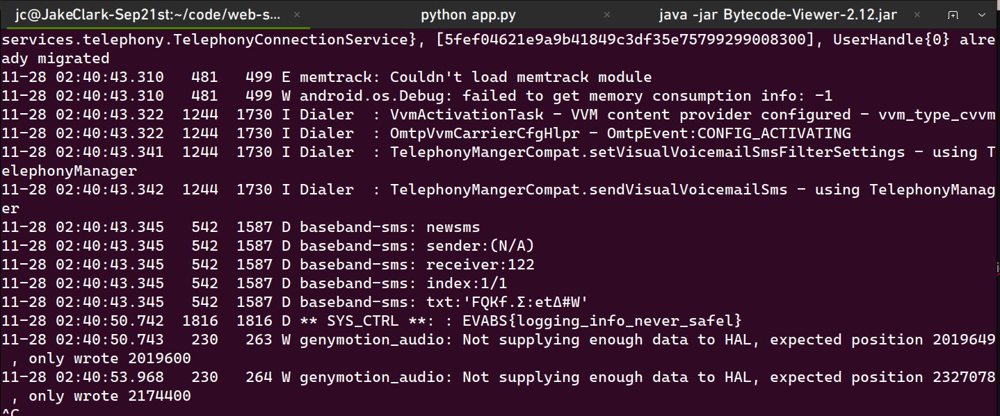

Flag: `EVABS{logging_info_never_safel}`

## Level 2: File Access

Đem file apk vào trong **Bytecode Viewer**, vào trong thư mục `assets`, thấy file `secret` và chứa flag:

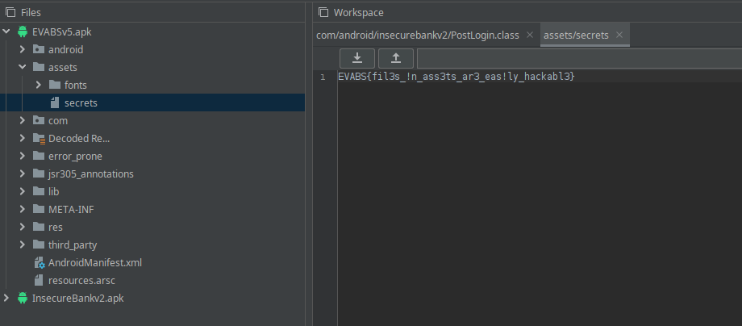

Flag: `EVABS{fil3s_!n_ass3ts_ar3_eas!ly_hackabl3}`

## Level 3: Strings

Sử dụng lệnh `apktool d Challenges/EVABSv5.apk` để decompile, sau đó vào thư mục `res/values/strings.xml`, kéo xuống cuối thì flag đã xuất hiện.

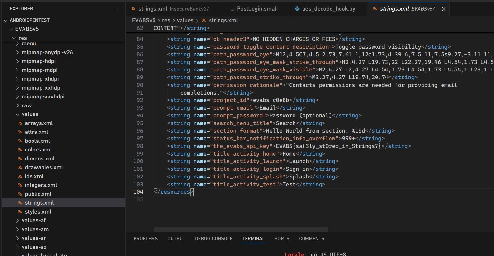

Flag: `EVABS{saf3ly_st0red_in_Strings?}`

## Level 4: Resources

Trong quá trình tìm hiểu sâu hơn thư mục `res` bằng lệnh `grep -r "EVABS{" .`, thì phát hiện thêm 1 flag nữa:

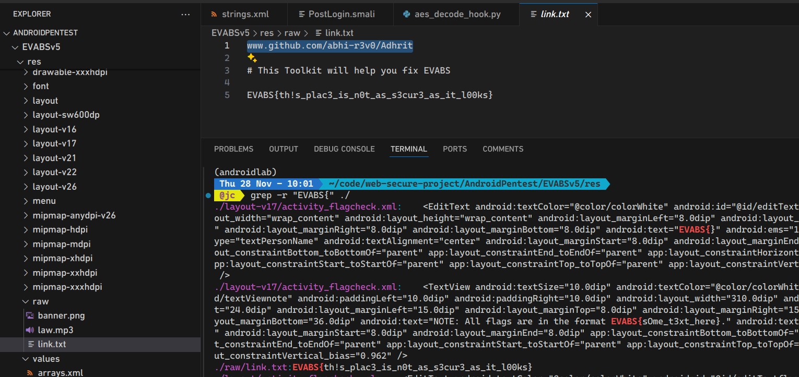

Flag: `EVABS{th!s_plac3_is_n0t_as_s3cur3_as_it_l00ks}`

## Level 5: Shares and Preferences

Sử dụng `adb shell`, cd vào thư mục `data/data/com.revo.evabs/shared_prefs/`, và thử lệnh `cat DETAILS.xml`, thấy flag tiếp theo:

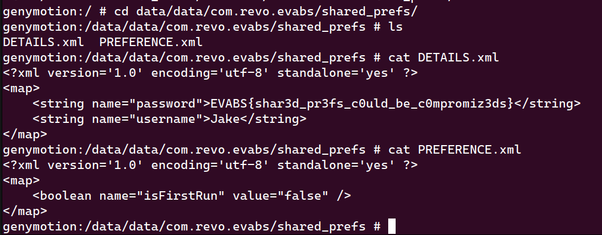

Flag: `EVABS{shar3d_pr3fs_c0uld_be_c0mpromiz3ds}`

## Level 6: Database Leak

Vẫn trong `adb shell`, cd vào thư mục `data/data/com.revo.evabs/databases`, sử dụng `sqlite3` để vào database `MAINFRAME_ACCESS`. Sau đó dùng lệnh `.tables` để liệt kê toàn bộ bảng và `select * from CREDS;`:

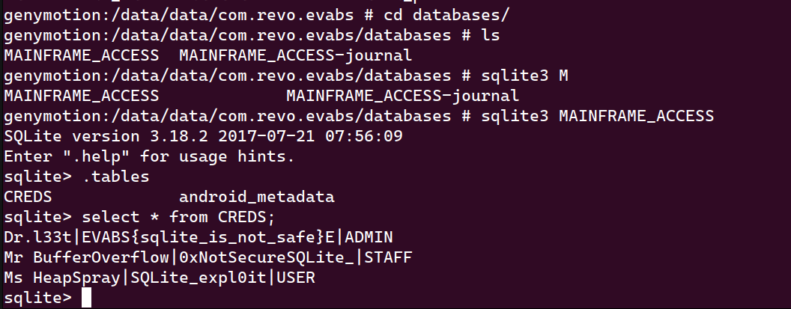

Flag: `EVABS{sqlite_is_not_safe}`

## Level 7: Export

Tính năng **Exported Activity** đã mở trong `AndroidManifest.xml`:

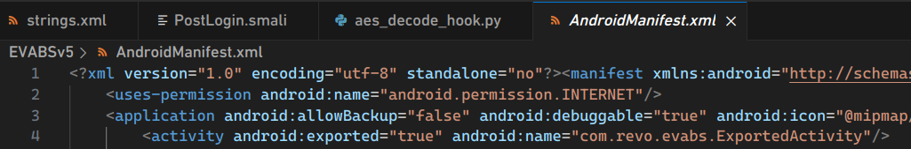

Vì thế trong `adb shell`, gọi Activity Manager: `am start -n com.revo.evabs/.ExportedActivity`. Màn hình Android đã xuất hiện flag:

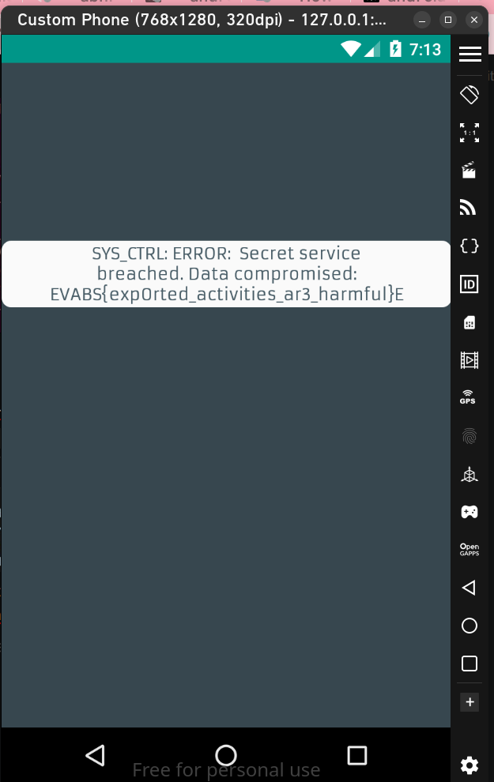

Flag: `EVABS{exp0rted_activities_ar3_harmful}`

## Level 8: Decode

Tìm kiếm trong Bytecode Viewer, trong `com/revo/evabs/Decode.class`, phát hiện 3 mảnh Base64. Lần lượt decode Base64 sang ASCII, flag xuất hiện:

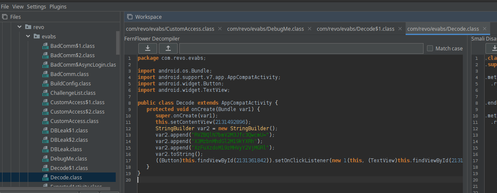

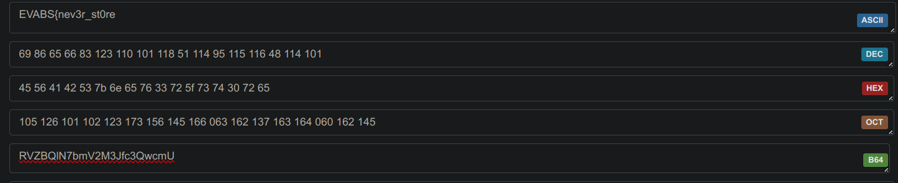
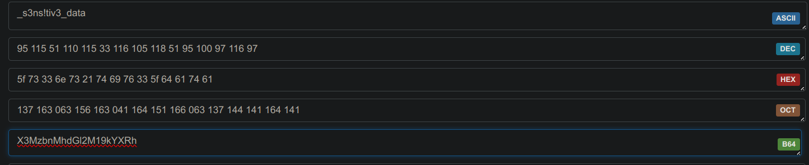
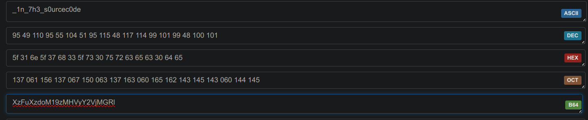

Flag: `EVABS{nev3r_st0re_s3ns!tiv3_data_1n_7h3_s0urc0de}`

## Level 9: Smali Injection

Sửa lại code Smali ở đường dẫn `EVABSv5/smali/com/revo/evabs/SmaliInject$2.smali` sao cho lệnh điều khiển để chuyển hướng đến `LAB_OFF` không còn nữa.

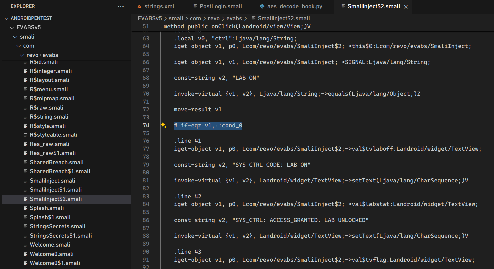

Sau đó đóng gói lại, ký file APK mới và cài nó:

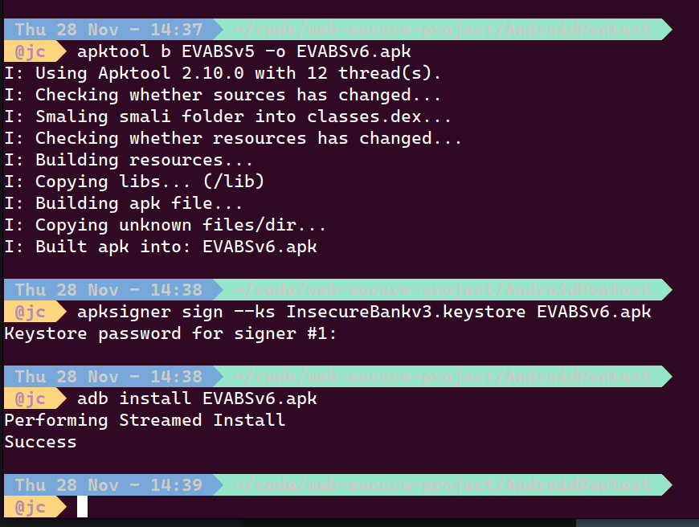

Mở lại ứng dụng, vào lại challenge và bấm nút **Turn On**:

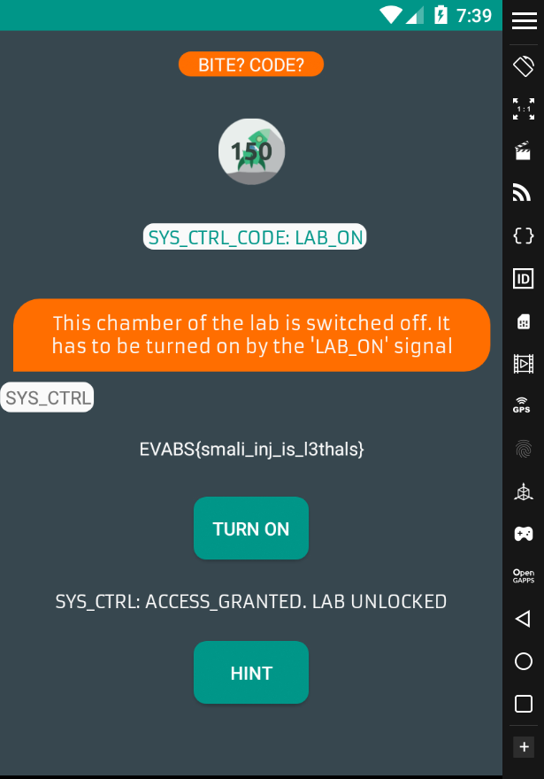

Flag: `EVABS{smali_inj_is_l3thals}`

## Level 11: Custom Access

Để có thể đọc được nội dung của `var2`, ta có thể sử dụng **Frida hook** để overload hàm `putExtra` để đọc nội dung trước khi nó được gửi đi.

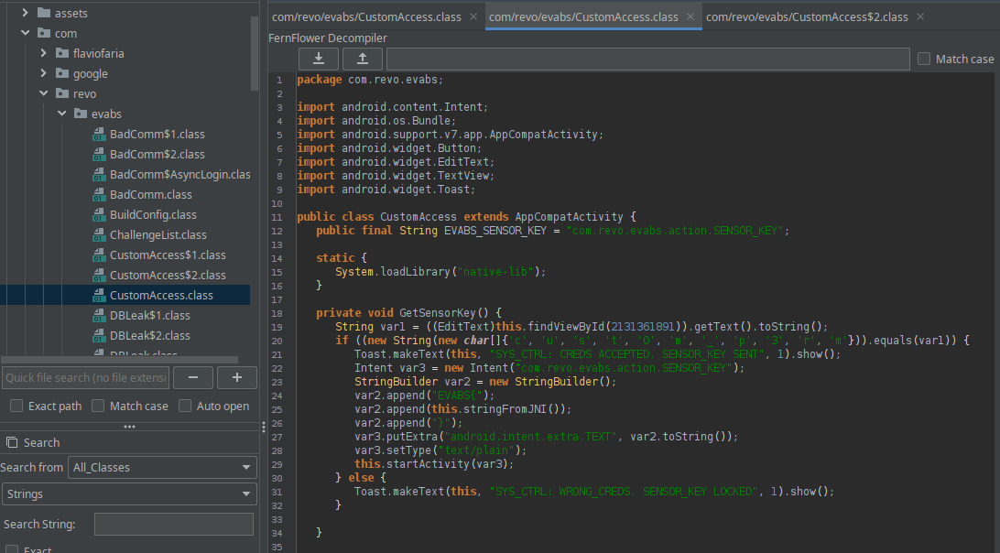

**Frida Script**:

```python
import frida
# ... (setup code)
hook_code = """
Java.perform(function () {
    var intentClass = Java.use('android.content.Intent');
    intentClass.putExtra.overload('java.lang.String', 'java.lang.String').implementation = function (str1, str2) {
        console.log("putExtra called with: " + str1 + " and " + str2);
        return this.putExtra(str1, str2);
    };
});
"""
# ...
```

Sau khi nhập input là `cust0m_p3rm`:


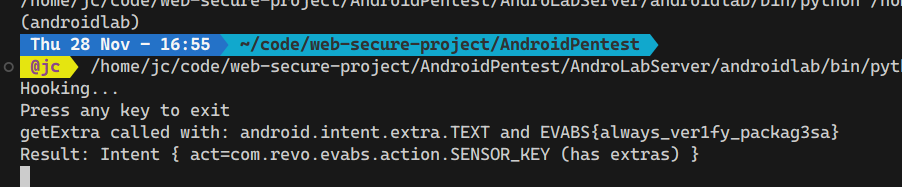

Flag: `EVABS{always_ver1fy_packag3sa}`

## Level 12: Instrument

Sử dụng hook để can thiệp vào hàm `nextInt` thay đổi giá trị trả về để thỏa mãn điều kiện `if`.

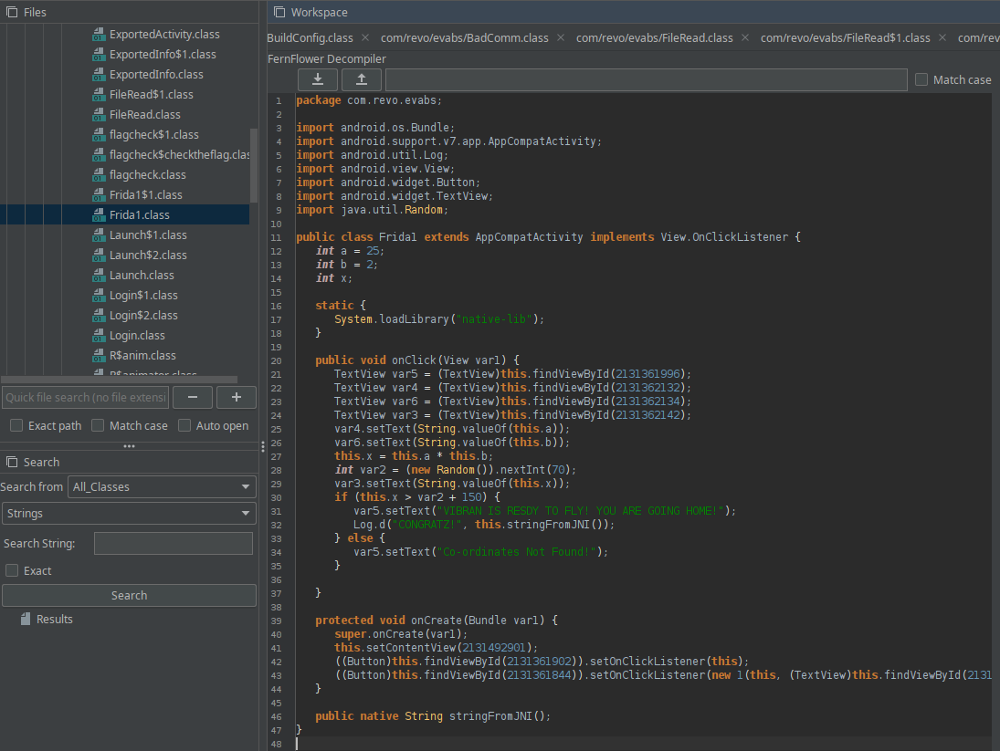

**Frida Script**:

```javascript
Java.perform(function () {
    var randomClass = Java.use('java.util.Random');
    randomClass.nextInt.overload('int').implementation = function (int) {
        console.log("nextInt called with: " + int);
        return -150; // Luôn trả về -150 để thỏa điều kiện < -100
    };
});
```

Bấm vào Map Area:

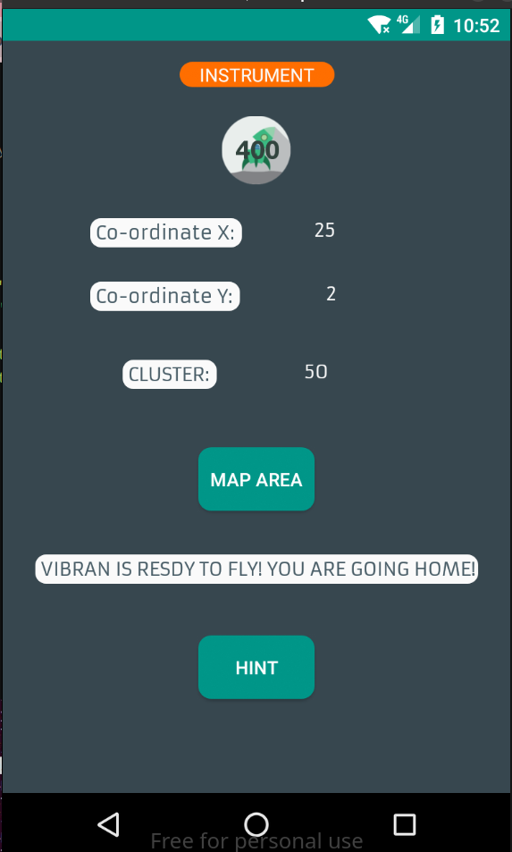
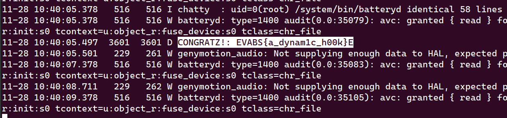

Flag: `EVABS{a_dynam1c_h00k}`

---

## 🛠 Toàn bộ Tool sử dụng

- **Genymotion**: Giả lập Android.
- **adb**: Truy cập shell, logcat, cài đặt app.
- **apktool**: Decompile và Rebuild APK.
- **Bytecode Viewer**: Xem source code và mã Smali.
- **Frida**: Hook và can thiệp runtime cực mạnh.
- **ChatGPT**: Tìm kiếm thông tin và giải quyết vấn đề nhanh hơn.
- **Não & Kỹ năng Linux**: Phân tích `AndroidManifest.xml` và linh hoạt xử lý.
