+++
title = "School Lab: PicoCTF Android Challenges"
date = 2023-08-30
description = "Write-up giải các thử thách Android trên PicoCTF (one.apk đến five.apk), áp dụng kiến thức về Logcat, Frida Hooking và Smali Patching."
[taxonomies]
tags = ["ctf", "picoctf", "android", "mobile-security", "frida", "smali", "reverse-engineering"]
[extra]
toc = true
+++

Loạt bài Lab thực hành Reverse Engineering ứng dụng Android thông qua các thử thách từ **PicoCTF**.

<!-- more -->

## Challenge 1: one.apk

Sau khi nhấn nút "Hello, I am a button", vào trong `adb logcat` để kiểm tra flag.

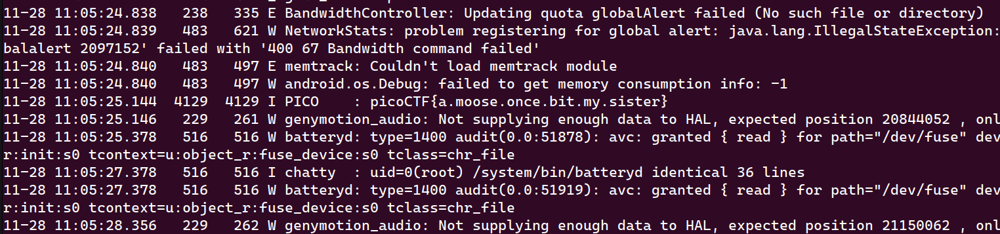

Flag: `picoCTF{a.moose.once.bit.my.sister}`

## Challenge 2: two.apk

**Source code** (sử dụng Bytecode Viewer để xem source code và code Smali):

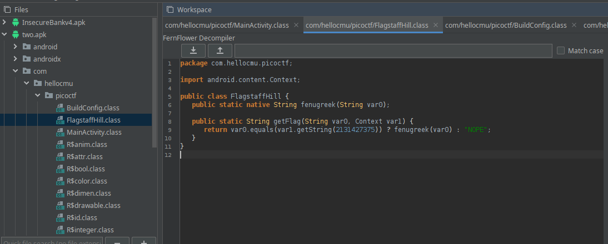
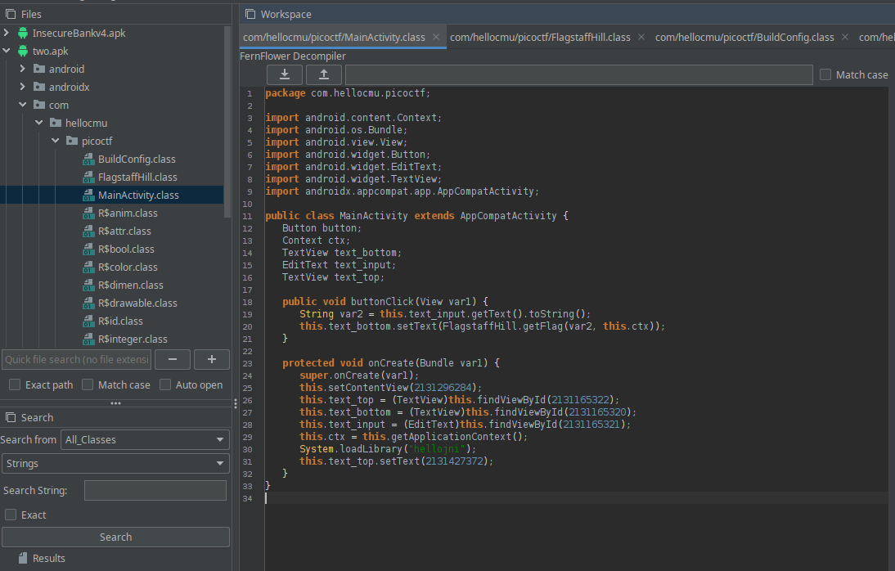

Chương trình so sánh đầu vào (`var0`) và đoạn text bí mật (`var1`). Ta dùng **Frida** để hook `Context.getString(int)` nhằm xem nội dung của `var1`:

```python
# Frida Hook Script
hook_code = """
Java.perform(function(){
    var Context = Java.use('android.content.Context');
    Context.getString.overload('int').implementation = function(resId) {
        var ret = this.getString(resId);
        console.log('Context.getString(int) -> ' + ret);
        return ret;
    };
});
"""
```

Kết quả sau khi hook:

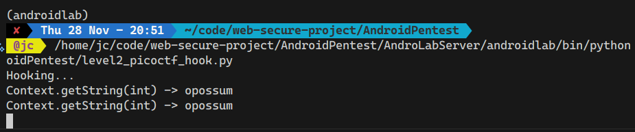
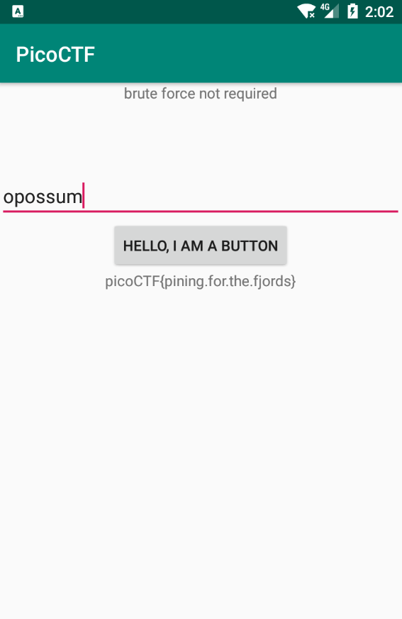

Flag: `picoCTF{pining.for.the.fjords}`

## Challenge 3: three.apk

Challenge này có thể giải bằng cách phân tích mã giả (pseudo-code) và tính toán thủ công:

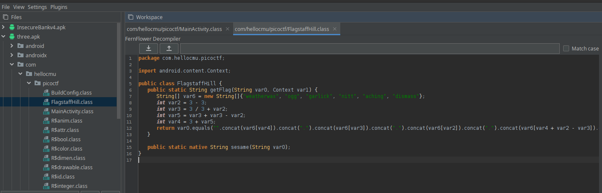

Các biến được tính toán như sau:
- `var2 = 0`, `var3 = 1`, `var5 = 2`, `var4 = 5`
- Thứ tự ghép chuỗi: `var6[5]`, `var6[1]`, `var6[0]`, `var6[4]`, `var6[3]`, `var6[2]`

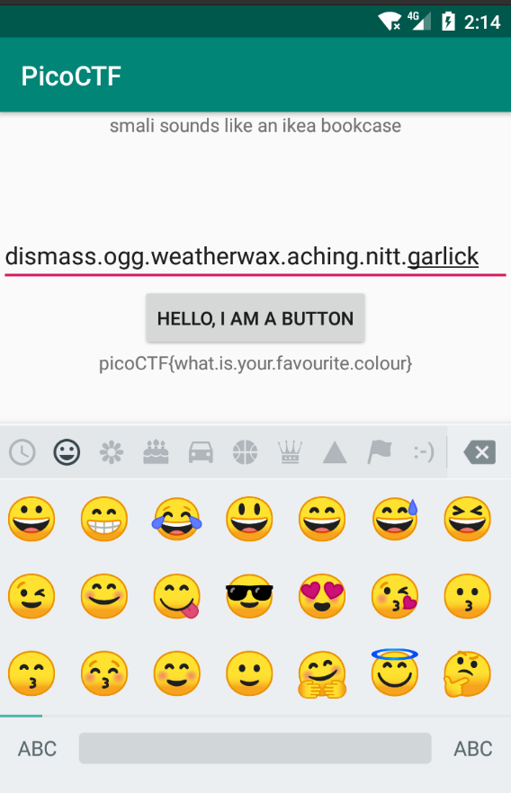

Flag: `picoCTF{what.is.your.favourite.colour}`

## Challenge 4: four.apk

Mục tiêu là dẫn chương trình đến hàm `cilantro` (nằm trong `yep`), nhưng `getFlag` mặc định gọi `nope`. Ta sử dụng `apktool` để sửa mã Smali:

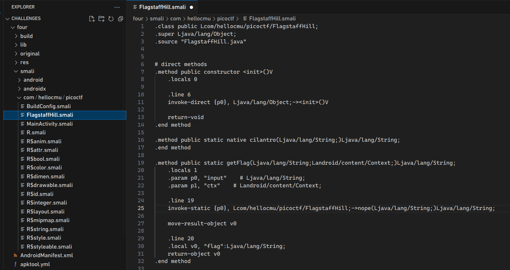
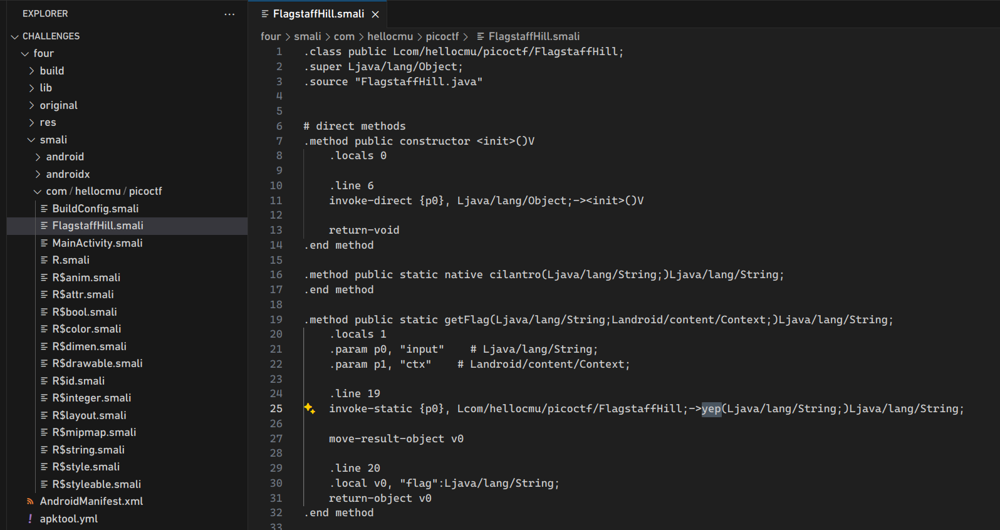

Sau đó đóng gói, ký và cài đặt lại APK:

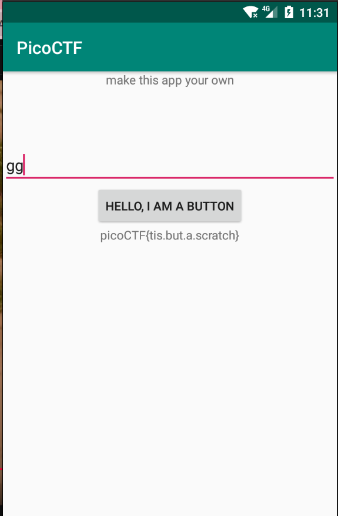

Flag: `picoCTF{tis.but.a.scratch}`

## Challenge 5: five.apk

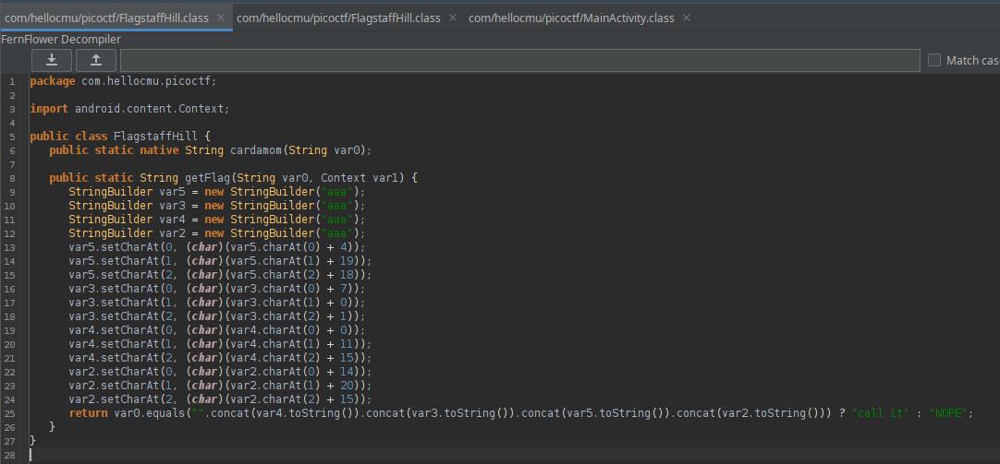

Phân tích chuỗi được tạo ra bởi `StringBuilder`:
- Các mảnh ghép lại: "alpha" + "bet" + "soup" = `alphabetsoup`.

Kiểm tra chuỗi:

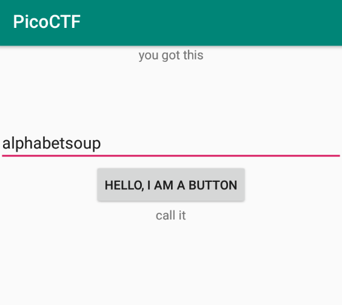

Tiến hành patch Smali để gọi trực tiếp hàm `cardamom`:


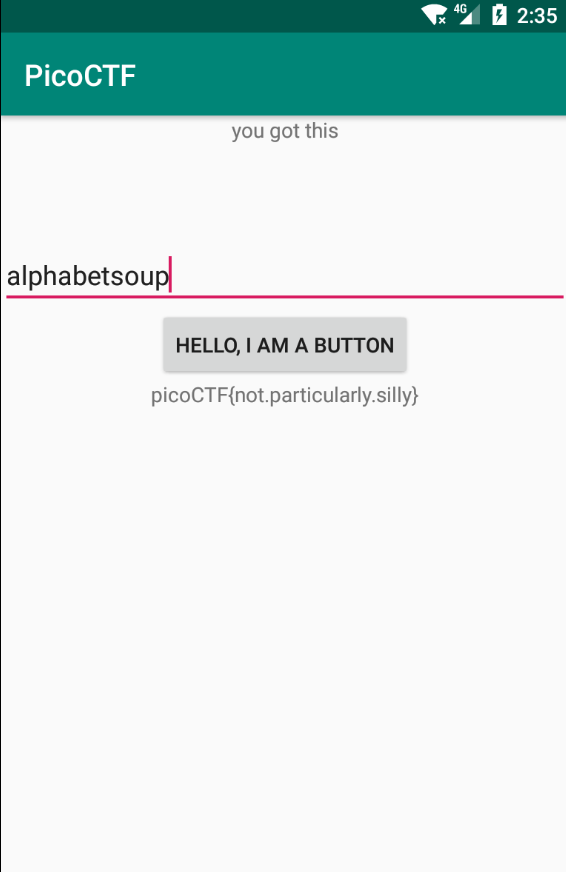

Flag: `picoCTF{not.particularly.silly}`
