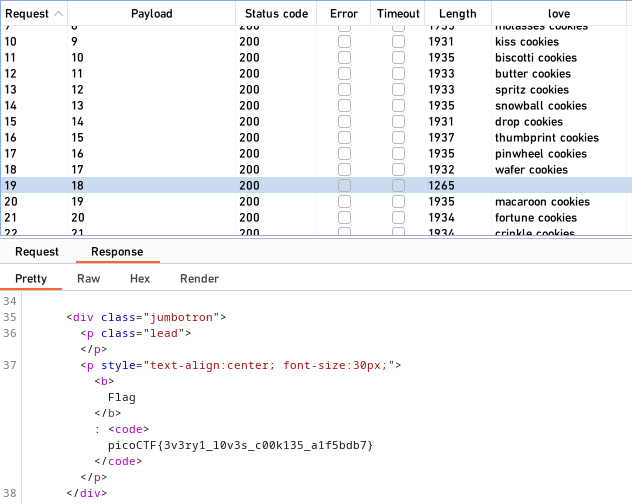
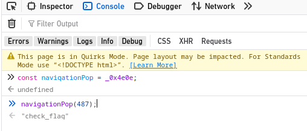

+++
title = "PicoCTF: Web App Solutions"
date = 2023-09-10
description = "Tổng hợp lời giải các bài tập Web Security trên PicoCTF, từ Cookies, Header (GET aHEAD) đến WebAssembly (Some Assembly Required)."
[taxonomies]
tags = ["ctf", "picoctf", "web", "cookies", "wasm", "js-deobfuscation"]
[extra]
toc = true
+++

Tổng hợp lời giải các bài tập Web trên PicoCTF.

Link: [PicoCTF Practice - Web](https://play.picoctf.org/practice?category=1&page=1)

<!-- more -->

## GET aHEAD

Chỉnh sửa request từ **GET** sang **HEAD** bằng Burp Suite (đơn giản thế thôi).

## Cookies

Sau khi nhập vào textbox `snickerdoodle`, ở mục `name` trong cookie ta phát hiện nếu ta thay đổi số thì nội dung sẽ thay đổi. Từ đó ta có thể dùng Burp Suite Intruder để tìm ra số nào xuất ra flag. Và ở đây ta thấy được ở vị trí 18 có flag:



## Inspect Me

Lần lượt vào F12 hoặc View Source và truy dò tất cả file, từ HTML đến CSS và JS từ tag `<head>`, ta nhận được:

```python
# Html is neat. Anyways have 1/3 of the flag: picoCTF{tru3_d3
# You need CSS to make pretty pages. Here's part 2/3 of the flag: t3ct1ve_0r_ju5t
# Javascript sure is neat. Anyways part 3/3 of the flag: _lucky?f10be399}
```

## Scavenger Hunt

**Cách 1 (Truy dò file)**: 
Vẫn như cũ, kiểm tra HTML, CSS, JS.
Đến file JS, ta lại nhìn thấy dòng cuối không còn là 1 phần của flag nữa. Qua tìm hiểu, ta còn 1 file đặc biệt là `robots.txt` chứa mảnh flag thứ 3. 

Trong `robots.txt` bảo đây là Apache server. Tiếp tục tìm hiểu "apache special file", ta thấy `.htaccess`, truy cập vào có mảnh thứ 4. Tuy nhiên, nó lại bảo nó thích làm web trên Mac. Liên quan đến Mac, ta có file đặc biệt `.DS_Store`. Truy cập vào file đó, ta thấy mảnh cuối cùng.

**Cách 2 (Tool)**: Dùng `dirsearch`:
```bash
dirsearch -u http://mercury.picoctf.net:39698/
```

## Some Assembly Required 1

Trang web này kiểm tra flag, nếu đúng thì hiện "Correct". Code JS đã được làm xáo trộn (obfuscated), mang code đến [jsnice.org](http://jsnice.org/) để dễ đọc hơn.

Ở console của trang web, ta có thể giải mã dần các giá trị:



Code sau khi làm sạch:

```jsx
let exports;
(async() => {
  let leftBranch = await fetch("./JIFxzHyW8W");
  let rightBranch = await WebAssembly["instantiate"](await leftBranch["arrayBuffer"]());
  let module = rightBranch["instance"];
  exports = module["exports"];
})();

function onButtonPress() {
  let params = document["getElementById"]("input")["value"];
  for (let i = 0; i < params["length"]; i++) {
    exports["copy_char"](params["charCodeAt"](i), i);
  }
  exports["copy_char"](0, params["length"]);
  if (exports["check_flag"]() == 1) {
    document["getElementById"]("result")["innerHTML"] = "Correct!";
  } else {
    document["getElementById"]("result")["innerHTML"] = "Incorrect!";
  }
}
```

File WebAssembly nằm ở `./JIFxzHyW8W`. Tải về:
```bash
wget http://mercury.picoctf.net:36152/JIFxzHyW8W -q -O script.wasm
```

Sử dụng `wasm-decompile` để đọc mã giả:
```bash
wasm-decompile script.wasm -o script.dcmp
```

Trong `script.dcmp`, ta thấy flag được lưu trực tiếp:
```cpp
data d_picoCTFREDACTED(offset: 1024) = "picoCTF{REDACTED_REDACTED_REDACTED}\00\00";
```

## More Cookies

Điểm đặc biệt của bài này là nó viết hoa 3 chữ **CBC**, chính là thuật toán mã hóa **AES-CBC**. Ta cần thực hiện Padding Oracle Attack hoặc Bit-flipping Attack tùy theo cấu trúc cụ thể của bài.
