+++
title = "TryHackMe: Lookup"
date = 2025-02-01
description = "Walkthrough challenge Lookup trên TryHackMe — Privilege Escalation (SUID, Sudo), elFinder command injection, brute-force credentials."
[taxonomies]
tags = ["ctf", "tryhackme", "privilege-escalation", "elfinder", "suid"]
[extra]
toc = true
+++

Walkthrough challenge **Lookup** trên TryHackMe — bao gồm **privilege escalation** (SUID, Sudo), **elFinder command injection**, và brute-force credentials.

<!-- more -->

Link: [https://tryhackme.com/room/lookup](https://tryhackme.com/room/lookup)

Keyword: Privilege Escalation (SUID, Sudo), elFinder, SUID

Cảm ơn [TheHiker](https://medium.com/@The_Hiker/lookup-tryhackme-walkthrough-thehiker-9276508b7d84)!

- Machine's IP address: 10.10.2??.???
- Attacker's IP address: 10.4.126.108 (OpenVPN to local)

## 0. RTFM

- Lookup… liên quan đến nslookup?
- Command injection?
- Web application weaknesses to privilege escalation techniques: from CVEs to SSH The Root!

## 1. Recon và brute-force credentials

Sử dụng nmap để scan port: `nmap -sC -sV 10.10.210.252`

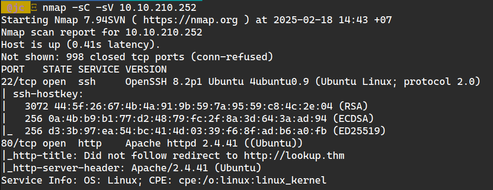

Phát hiện 2 port: 22 (SSH, cần password) và 80 (web server).

Truy cập `http://10.10.210.252` — không vào được vì `lookup.thm` chưa resolve. Thêm vào `/etc/hosts`:

```
10.10.210.252   lookup.thm
```

Thấy login page, nhưng không có gì đặc biệt:

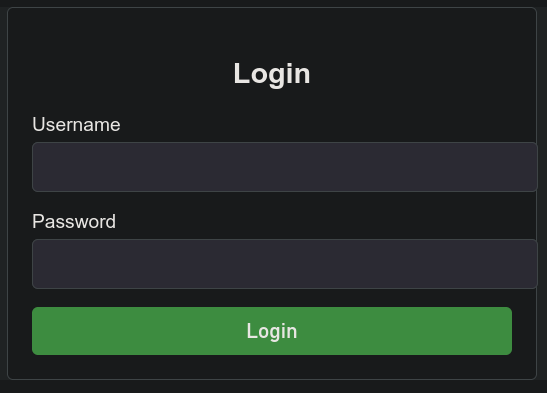

Test các vulnerability: SQL injection, XSS, default credentials, CVEs… không có gì hoạt động.

Giải pháp: **brute-force** username và password. Dùng Burp Suite Intruder.

Nếu username đúng + password sai → response khác. Test: admin + password sai:

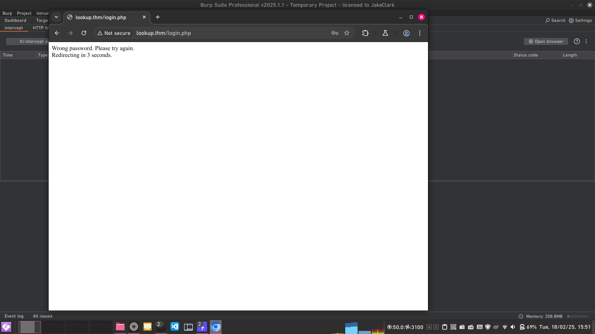

Setup Intruder:

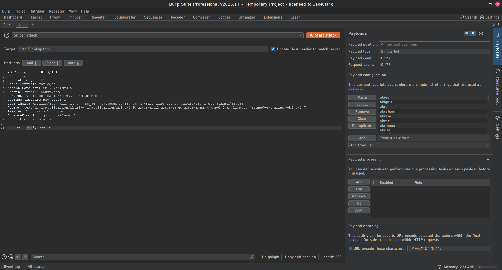

Phát hiện 2 username đúng: **admin** và **jose**.

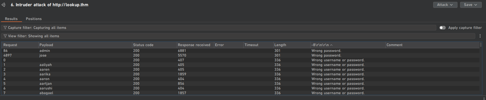

Brute-force password của jose:

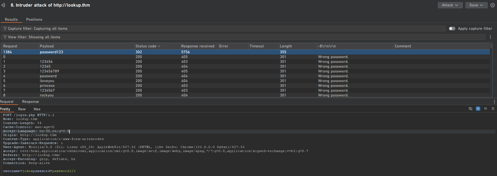

Đăng nhập:

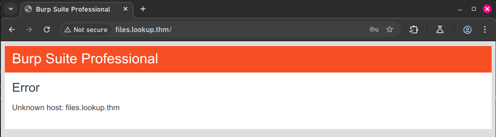

Subdomain mới? Thêm vào hosts:

```
10.10.210.252   lookup.thm
10.10.210.252   files.lookup.thm
```

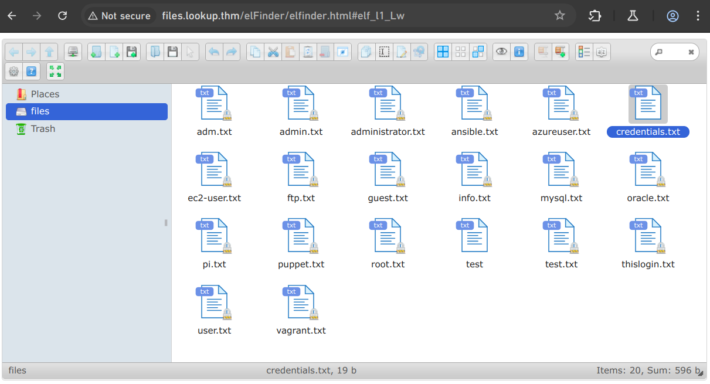

File `credentials.txt` chứa: `think: nopassword`.

## 2. Attack elFinder

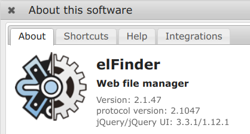

Version **elFinder 2.1.47**. Dùng `searchsploit`:

```bash
$ searchsploit elFinder 2.1.47 -w
 Exploit Title                                         |  URL
-------------------------------------------------------
elFinder 2.1.47 - 'PHP connector' Command Injection    | https://www.exploit-db.com/exploits/46481
```

Tìm được PoC Python: [github.com/hadrian3689/elFinder_2.1.47_php_connector_rce](https://github.com/hadrian3689/elFinder_2.1.47_php_connector_rce/blob/main/exploit.py)

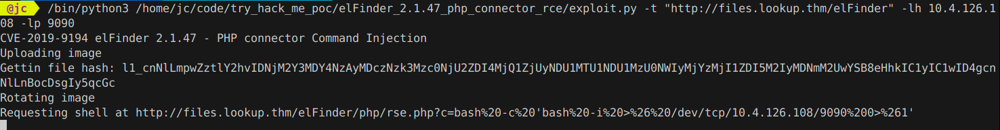


Đã có shell ở **www-data**!

## 3. Privilege Escalation từ www-data

Đọc `/etc/passwd`:

```bash
$ cat /etc/passwd | grep sh$
root:x:0:0:root:/root:/usr/bin/bash
think:x:1000:1000:,,,:/home/think:/bin/bash
```

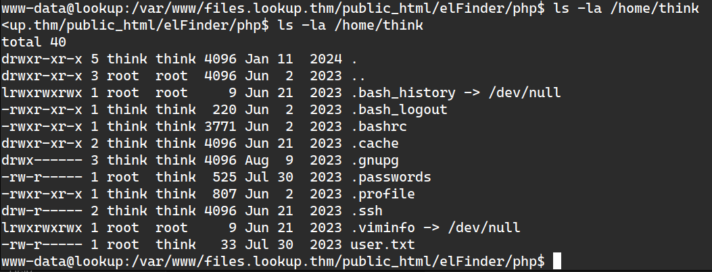

Cần đọc `.passwords` và `user.txt` nhưng chỉ có quyền www-data. Tìm SUID binary: `find / -perm /4000 2>/dev/null`

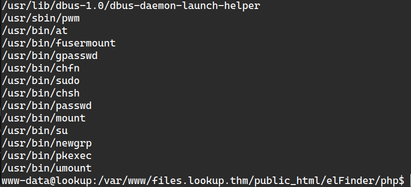

`pwm` là binary lạ. Chạy thử:

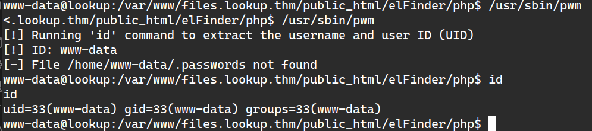

`pwm` extract username từ `id` command → tạo fake `/tmp/id` để giả làm user "think":

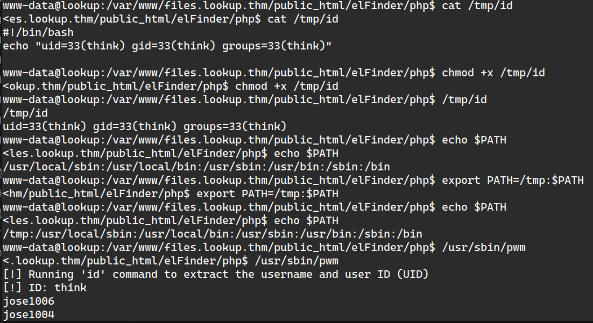

Dùng hydra brute-force SSH password:

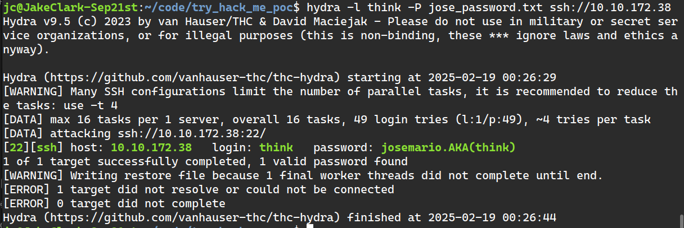

Login SSH vào think, chuyển sang phase 2…

## 4. Privilege Escalation từ "think"

Kiểm tra `sudo -l`:

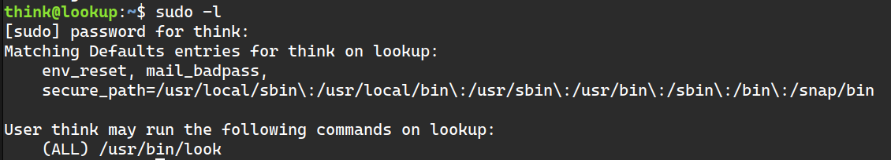

Có thể dùng `look` binary với sudo → [GTFOBins](https://gtfobins.github.io/gtfobins/look/):

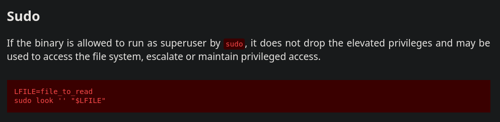

Kiểm tra `.ssh` folder:

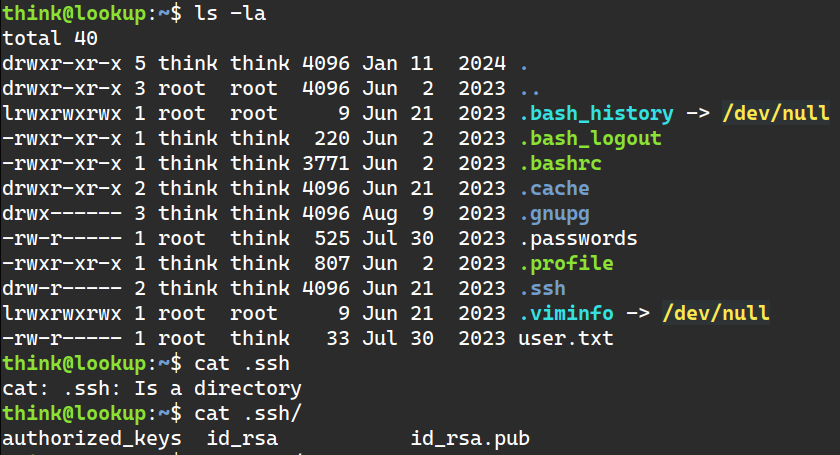

- **Private key** (id_rsa) proves identity, dùng để authentication
- **Public key** (id_rsa.pub) allows authentication from corresponding private key

File cần đọc: **private key của root's SSH**.

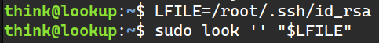

Copy key về máy, set permission 600, login lại:


**Root is pwned!** 🎉

Cảm ơn TheHiker rất nhiều đã giúp mình giải challenge này!
