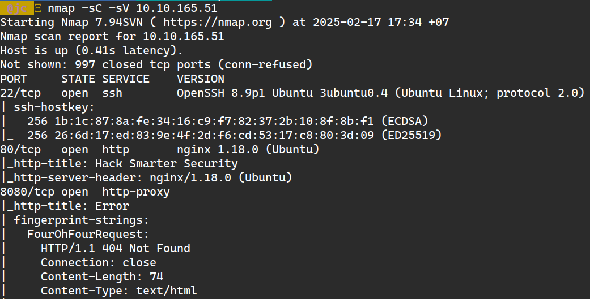
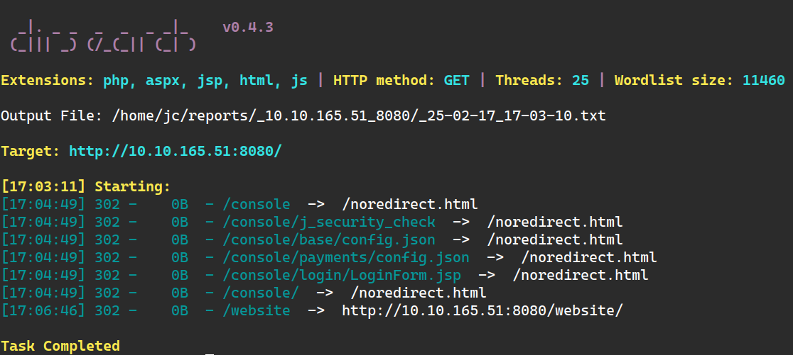
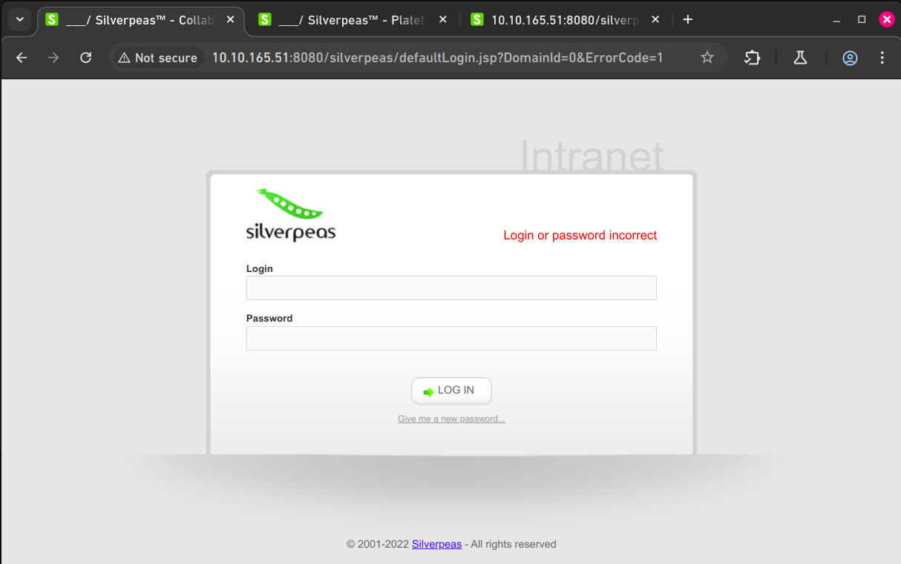
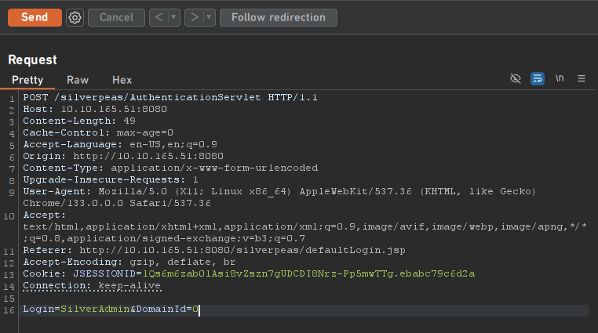
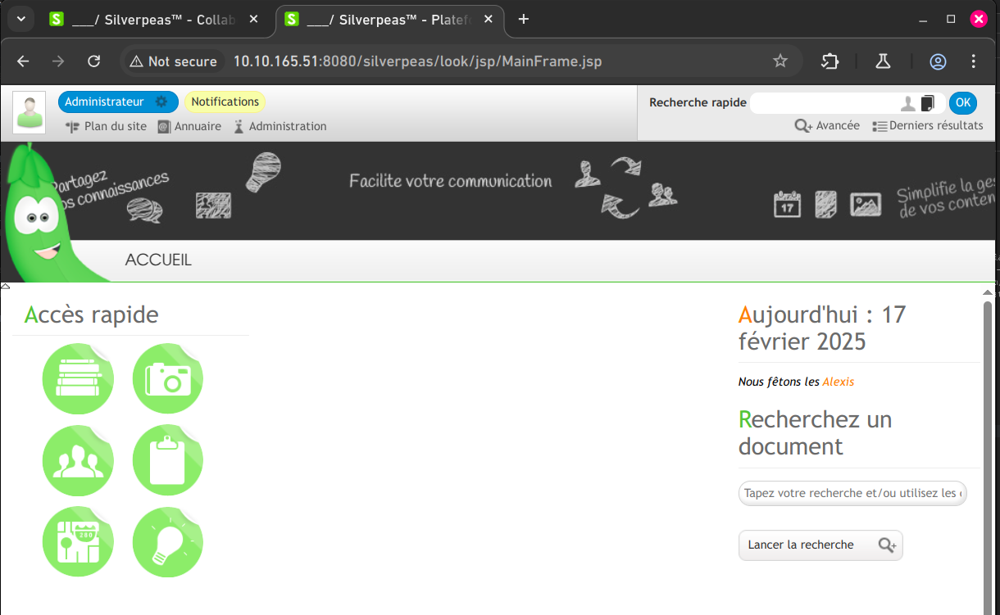
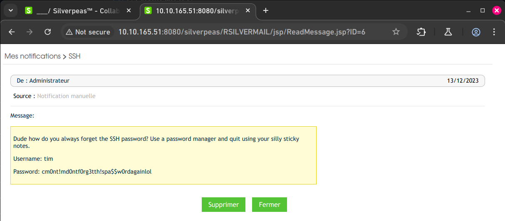
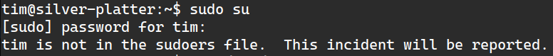
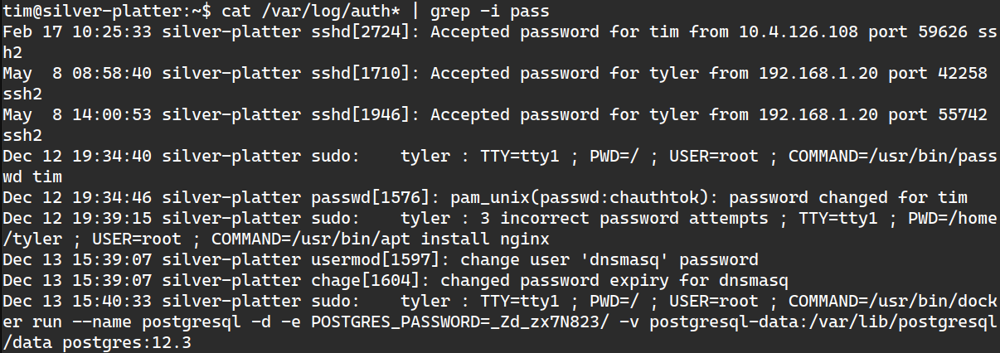
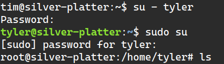

+++
title = "TryHackMe: Silver Platter"
date = 2025-02-05
description = "Walkthrough challenge Silver Platter trên TryHackMe — Silverpeas CVE, IDOR, credential bypass, privilege escalation."
[taxonomies]
tags = ["ctf", "tryhackme", "silverpeas", "privilege-escalation", "cve"]
[extra]
toc = true
+++

Walkthrough challenge **Silver Platter** trên TryHackMe — exploit **Silverpeas CVE**, **credential bypass**, **IDOR**, và **privilege escalation**.

<!-- more -->

Link: [https://tryhackme.com/room/silverplatter](https://tryhackme.com/room/silverplatter)

Keyword: Silverpeas, Privilege Escalation

Cảm ơn [TheHiker](https://medium.com/@The_Hiker/silver-platter-tryhackme-walkthrough-thehiker-1dd6a014f3b4)!

> **Tips**: Đừng dùng free AttackBox của TryHackMe! Thay vào đó dùng OpenVPN để tự do thử nghiệm!

## 1. Recon

Nmap scan: `nmap -sC -sV 10.10.165.51`

Phát hiện 3 port: 22, 80, 8080. Port 22 là SSH cần password.



Thông tin: Ubuntu + Nginx proxy.

Truy cập `http://10.10.165.51` — không thấy gì, nhưng About page gợi ý hệ thống dùng **Silverpeas**.

Dùng dirsearch trên port 8080, phát hiện subdirectories nhưng đều redirect:



## 2. Attack Silverpeas

Thử `http://10.10.165.51:8080/Silverpeas` → login page!



Phiên bản cũ (2022), có thể exploit CVE 2023:

- [Credential bypass CVE](https://gist.github.com/ChrisPritchard/4b6d5c70d9329ef116266a6c238dcb2d)
- [CVE-2023-47323: IDOR](https://github.com/RhinoSecurityLabs/CVEs/tree/master/CVE-2023-47323)

Dùng Burp Suite, xoá password field → bypass authentication:



Admin page!



Exploit IDOR — thay đổi messageID để đọc tin nhắn, tìm credentials:



## 3. SSH và Privilege Escalation

SSH vào: `ssh tim@10.10.165.51`

tim là user thường, không có sudo:



Tìm trong `/etc/passwd`: user **tyler** có root privileges:

```
tyler:x:1000:1000:root:/home/tyler:/bin/bash
```

Kiểm tra group: tim thuộc group **4(adm)** → có thể đọc log. Tìm password trong log:

```bash
cat /var/log/auth* | grep -i pass
```



Root đã truy cập PostgreSQL với **cleartext password** → thử cho tyler:



**Privilege escalation thành công!** 🎉

Cảm ơn TheHiker đã giúp mình giải challenge EASY này!
