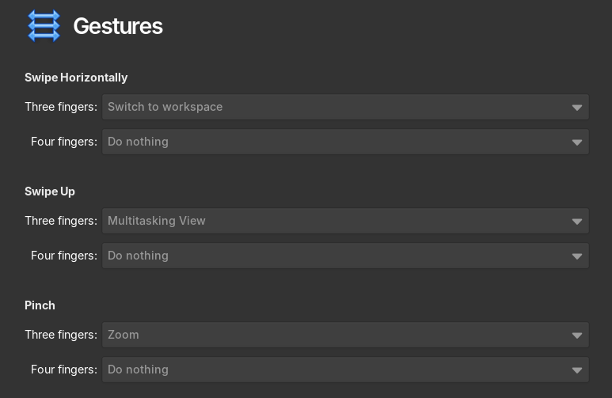
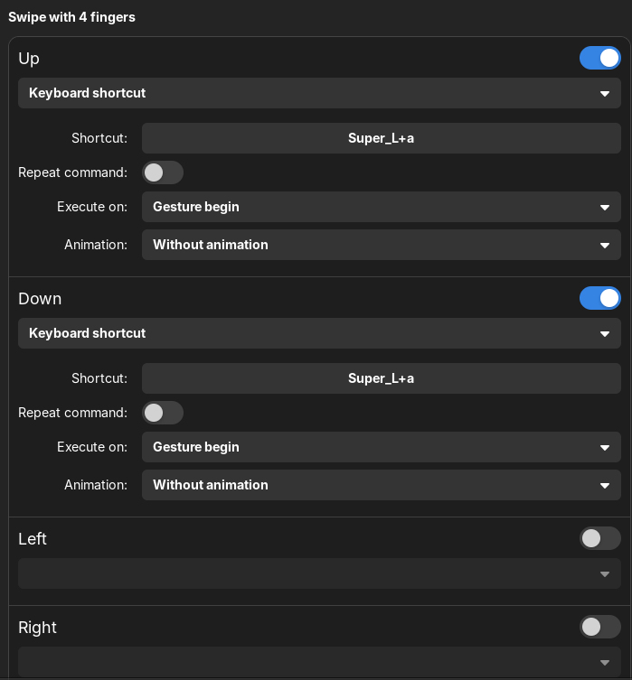
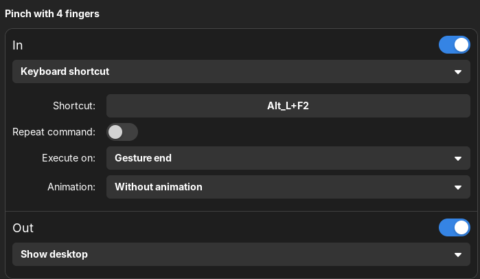
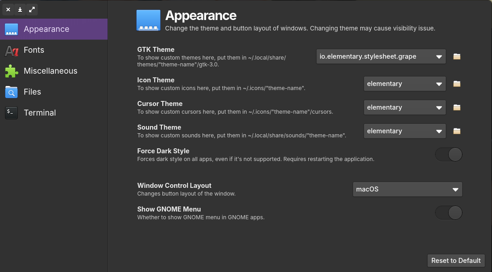
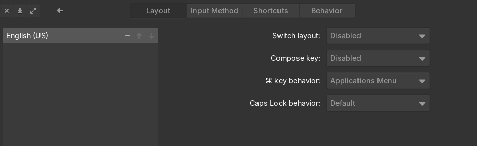
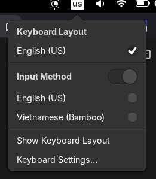
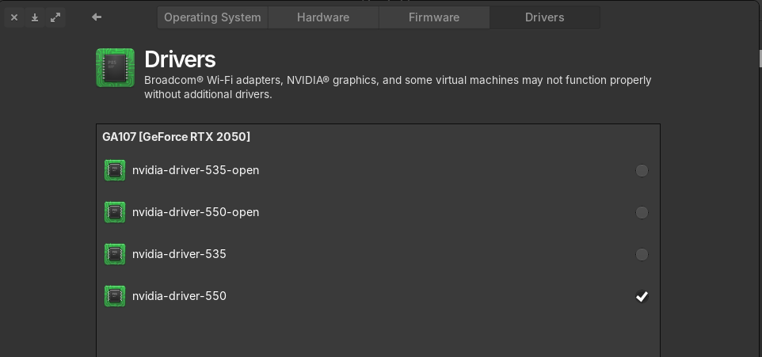

+++
title = "Cài đặt Elementary OS trên Ubuntu Server và thiết lập cá nhân"
date = 2025-01-20
description = "Hướng dẫn chi tiết cài đặt Elementary OS (Pantheon) trên Ubuntu Server 24.04, bao gồm cấu hình mạng, gesture, IBus tiếng Việt, driver Nvidia, Docker, Distrobox, và tối ưu pin."
[taxonomies]
tags = ["linux", "elementary-os", "ubuntu", "pantheon", "docker"]
[extra]
toc = true
+++

Hướng dẫn chi tiết cài đặt **Elementary OS** (Pantheon desktop) trên **Ubuntu Server 24.04**, bao gồm cấu hình mạng, gesture, IBus tiếng Việt, driver Nvidia, Docker, Distrobox, và tối ưu pin laptop.

<!-- more -->

## 1. Trước khi cài

- Ubuntu Server 24.04 ISO
- Kết nối Internet ổn định

## 2. Cài đặt

### 2.1. Ubuntu Server

- Cài Ubuntu Server 24.04 Minimal version
- Làm theo hướng dẫn cài đặt

### 2.2. Elementary OS PPA

Sau khi boot vào terminal Ubuntu, chạy:

```bash
sudo add-apt-repository ppa:elementary-os/stable
sudo apt update
sudo apt install elementary-desktop
```

Vào LightDM:

```bash
sudo service lightdm restart
```

## 3. Sau cài đặt — Cài đặt hệ thống

### 3.1. Mạng

ElementaryOS (và các distro khác) dùng NetworkManager. Để netplan dùng NetworkManager:

```bash
sudo nano /etc/netplan/50-cloud-init.yaml
```

```yaml
network:
    ethernets: {}
    version: 2
    renderer: NetworkManager  # ← Thêm dòng này
```

```bash
sudo netplan apply
```

### 3.2. Cử chỉ đa chạm (Multi-touch gesture)

Mặc định Touchegg chưa được cài. Để cài:

```bash
sudo add-apt-repository ppa:touchegg/stable
sudo apt install touchegg
```

Reboot, sau đó tuỳ chỉnh trong **Settings → Mouse & Touchpad → Gestures**.



Cài thêm **Touche** từ AppCenter để tuỳ chỉnh gesture:





### 3.3. Tắt service chờ mạng

Ubuntu Server có service chờ kết nối mạng trước khi khởi động desktop:

```bash
sudo systemctl disable systemd-networkd-wait-online.service
sudo systemctl mask systemd-networkd-wait-online.service
```

### 3.4. Pantheon-tweak

Cài pantheon-tweak từ Flatpak/AppCenter để tuỳ chỉnh font desktop:



### 3.5. IBus và gõ tiếng Việt

Elementary OS tích hợp IBus khá kém so với GNOME. Workaround:

1. Cài engine yêu thích (mình chọn **Bamboo**):

```bash
sudo add-apt-repository ppa:bamboo-engine/ibus-bamboo
sudo apt install ibus-bamboo
```

2. Vào **Settings → Keyboard**, đảm bảo chỉ có layout **English (US)**:



3. Trong **Input Method**, thêm Bamboo và tuỳ chỉnh shortcut:


4. Đảm bảo Keyboard Layout là **English (US)**:



5. Nhấn **Alt + Space** để chuyển bàn phím. Tuy nhiên, Wingpanel (Pantheon top panel) không hiển thị status indicator nên bạn không biết đang dùng input method nào 😞

### 3.6. Driver Nvidia (tuỳ chọn)

Vào **Settings → System → Driver** để cài driver:



## 4. Sau cài đặt — Hệ thống

### 4.1. Tối ưu SSD

TRIM hàng ngày, tạo zswap, giảm wear cho Firefox:

[https://easylinuxtipsproject.blogspot.com/p/ssd.html#ID6](https://easylinuxtipsproject.blogspot.com/p/ssd.html#ID6)

### 4.2. Tăng swapfile

```bash
sudo swapoff /swap.img
sudo rm /swap.img
sudo fallocate -l 8G /swap.img
sudo chmod 600 /swap.img
sudo mkswap /swap.img
sudo swapon /swap.img
```

### 4.3. Đồng bộ đồng hồ cho dual-boot Windows

```bash
timedatectl set-local-rtc 1
```

## 5. Sau cài đặt — Ứng dụng

### 5.1. Pacstall

Pacstall là AUR cho Ubuntu:

```bash
sudo bash -c "$(curl -fsSL https://pacstall.dev/q/install)"
pacstall -I zen-browser-bin lm-studio-app osu-lazer-app fastfetch-git
```

### 5.2. Python virtualenv — uv (Astral)

```bash
curl -LsSf https://astral.sh/uv/install.sh | sh
uv venv
uv add <tên-package>...
```

### 5.3. oh-my-zsh

```bash
sudo apt install git zsh zsh-autosuggestions
git clone https://github.com/zsh-users/zsh-autosuggestions \
  ${ZSH_CUSTOM:-~/.oh-my-zsh/custom}/plugins/zsh-autosuggestions
sh -c "$(curl -fsSL https://raw.githubusercontent.com/ohmyzsh/ohmyzsh/master/tools/install.sh)"
```

Cấu hình `~/.zshrc`:

```bash
ZSH_THEME="candy-kali"
ZSH_CUSTOM=~/.zsh-custom
plugins=(git zsh-autosuggestions vscode)

if [ -d "$HOME/.local/bin" ] ; then
    PATH="$HOME/.local/bin:$PATH"
fi

alias dockps='docker ps --format "{{.ID}}  {{.Names}}"'
docksh() { docker exec -it $1 $2; }
```

### 5.4. Docker và Distrobox

```bash
# Gỡ các package xung đột
for pkg in docker.io docker-doc docker-compose docker-compose-v2 podman-docker containerd runc; do
  sudo apt-get remove $pkg
done

# Cài Docker
sudo apt-get install ca-certificates curl
sudo install -m 0755 -d /etc/apt/keyrings
sudo curl -fsSL https://download.docker.com/linux/ubuntu/gpg -o /etc/apt/keyrings/docker.asc
sudo chmod a+r /etc/apt/keyrings/docker.asc
echo \
  "deb [arch=$(dpkg --print-architecture) signed-by=/etc/apt/keyrings/docker.asc] https://download.docker.com/linux/ubuntu \
  $(. /etc/os-release && echo "${UBUNTU_CODENAME:-$VERSION_CODENAME}") stable" | \
  sudo tee /etc/apt/sources.list.d/docker.list > /dev/null
sudo apt update
sudo apt-get install docker-ce docker-ce-cli containerd.io docker-buildx-plugin docker-compose-plugin
```

Distrobox và Kali Linux:

```bash
curl -s https://raw.githubusercontent.com/89luca89/distrobox/main/install | sudo sh
distrobox create --name kali --image docker.io/kalilinux/kali-rolling:latest
distrobox enter kali
```

### 5.5. Tối ưu pin laptop

**Powertop:**

```bash
sudo apt install powertop
```

Tạo `/etc/systemd/system/powertop.service`:

```ini
[Unit]
Description=Powertop tunings

[Service]
Type=oneshot
RemainAfterExit=yes
ExecStart=/usr/sbin/powertop --auto-tune
ExecStartPost=/bin/sh -c 'for f in $(grep -l "Mouse" /sys/bus/usb/devices/*/product | sed "s/product/power\\/control/"); do echo on >| "$f"; done'

[Install]
WantedBy=multi-user.target
```

**Auto-CPU-freq:**

```bash
git clone https://github.com/AdnanHodzic/auto-cpufreq.git
cd auto-cpufreq && sudo ./auto-cpufreq-installer
sudo auto-cpufreq-gtk
echo 'eval "$(_AUTO_CPUFREQ_COMPLETE=zsh_source auto-cpufreq)"' >> ~/.zshrc
```
