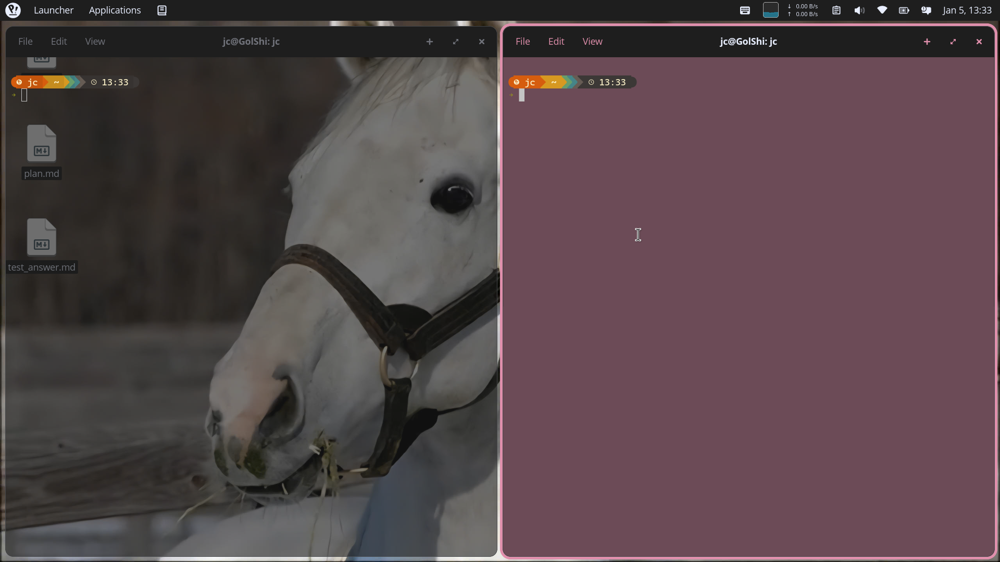
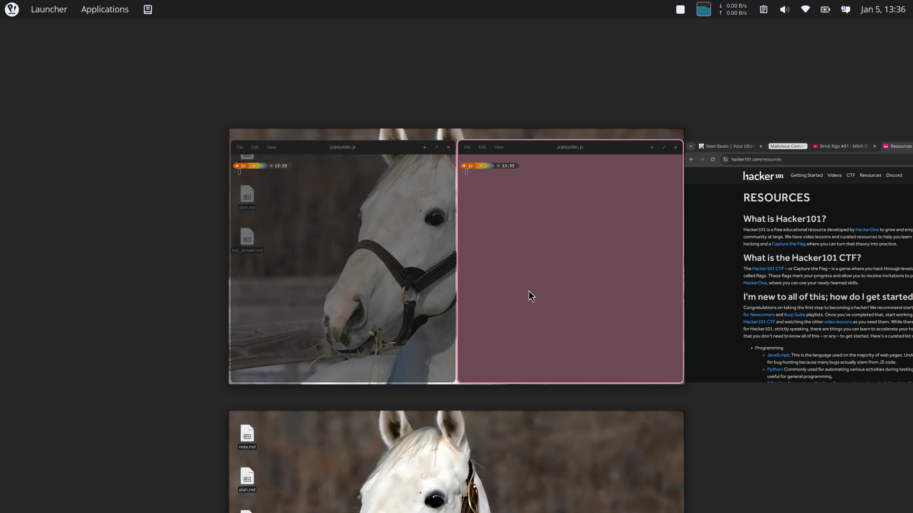

+++
title = "Install COSMIC DE + Niri on Ubuntu 24.04"
date = 2025-02-25
description = "A comprehensive guide to installing COSMIC Desktop Environment with Niri compositor on Ubuntu 24.04 LTS, including workarounds for screen recording and screencasting."
[taxonomies]
tags = ["linux", "cosmic", "niri", "wayland", "ubuntu"]
[extra]
toc = true
+++

A detailed guide to installing **COSMIC Desktop Environment** with the **Niri** compositor on Ubuntu 24.04 LTS. This post also covers automated upgrades with Topgrade and workarounds for screen recording/screencasting.

<!-- more -->

## Requirements

- **COSMIC DE** (built-in to Pop!_OS 24.04 LTS or other bleeding-edge distros; these steps run inside Ubuntu 24.04 LTS, and most components must be built from source)
- **Rust environment**: `curl --proto '=https' --tlsv1.2 -sSf https://sh.rustup.rs | sh`
- **Just**: `sudo apt install just`

---

## Installation Steps

### Step 1: Configure cargo-update for future updates

```bash
cargo install cargo-update
```

For future updates, run: `cargo install-update --all --git --locked`

### Step 2: Install dependencies

Install wlsunset to configure night light, and brightnessctl to handle brightness keybinds:

```bash
sudo apt install gcc clang libudev-dev libgbm-dev libxkbcommon-dev \
  libegl1-mesa-dev libwayland-dev libinput-dev libdbus-1-dev \
  libsystemd-dev libseat-dev libpipewire-0.3-dev libpango1.0-dev \
  libdisplay-info-dev brightnessctl wlsunset
sudo usermod -aG video $USER

# For fcitx5 (Vietnamese input method)
sudo apt install fcitx5 fcitx5-bamboo fcitx5-config-qt
```

> ⚠️ Please log out after running this step to apply the group change.

### Step 3: Install Niri

Clone Niri and set up the update script:

```bash
git clone https://github.com/YaLTeR/niri.git
cd niri
```

Create a `Justfile` for easy updates:

```just
default: update-install

update-install:
    @echo "🚀 Updating Niri from Git..."
    git pull

    @echo "⚙️  Building Release (this takes a while)..."
    cargo build --release --locked

    @echo "📦 Installing to system (needs sudo)..."
    sudo install -m 755 target/release/niri /usr/local/bin/niri
    sudo install -m 755 resources/niri-session /usr/local/bin/niri-session

    sudo mkdir -p /usr/local/share/wayland-sessions/
    sudo install -m 644 resources/niri.desktop /usr/local/share/wayland-sessions/

    sudo mkdir -p /usr/local/share/xdg-desktop-portal/
    sudo install -m 644 resources/niri-portals.conf /usr/local/share/xdg-desktop-portal/

    sudo install -m 644 resources/niri.service /etc/systemd/user/
    sudo install -m 644 resources/niri-shutdown.target /etc/systemd/user/

    systemctl --user daemon-reload

    @echo "✅ Done! Logout and login again to use the new version."
```

Build & Install:

```bash
just update-install
# You will need root privilege to install new binaries
```

### Step 4: Install xwayland-satellite

This adds X11 support for legacy applications:

```bash
cargo install --locked --git https://github.com/Supreeeme/xwayland-satellite.git
```

### Step 5: Install COSMIC Extension Extra Sessions

This connects COSMIC with Niri as the compositor:

```bash
git clone https://github.com/Drakulix/cosmic-ext-extra-sessions.git
cd cosmic-ext-extra-sessions
just build
sudo just install-niri
```

### Step 6: Configure Niri

Copy settings to `~/.config/niri/config.kdl`. My settings are fairly complete for my system; you can customize them as needed.

The config below ensures that fcitx5 runs perfectly. If you don't use fcitx5, you can remove the `environments` block and the fcitx5 spawn command.

**Dependency**: `fcitx5`

<details>
<summary>View the full config.kdl (click to expand)</summary>

```kdl
input {
    keyboard {
        xkb { }
    }
    touchpad {
        tap
        natural-scroll
    }
    mouse {
        accel-speed -0.55
        accel-profile "flat"
    }
}

output "eDP-1" {
    mode "1920x1080@144"
    scale 1.25
    transform "normal"
    position x=0 y=0
    variable-refresh-rate on-demand=true
}

layout {
    gaps 8
    center-focused-column "never"
    preset-column-widths {
        proportion 0.33333
        proportion 0.5
        proportion 0.66667
        proportion 1.0
    }
    default-column-width { proportion 0.5; }

    focus-ring {
        width 4
        active-color "#E08FAC"
        inactive-color "#252538"
    }
    border {
        off
        width 4
        active-color "#E08FAC"
        inactive-color "#36364F"
        urgent-color "#9b0000"
    }
}

environment {
    MOZ_ENABLE_WAYLAND "1"
    GDK_BACKEND "wayland,x11"
    QT_QPA_PLATFORM "wayland;xcb"
    SDL_VIDEODRIVER "wayland"
    CLUTTER_BACKEND "wayland"
    XDG_CURRENT_DESKTOP "Niri"
    XDG_SESSION_TYPE "wayland"
    XDG_SESSION_DESKTOP "Niri"
    GTK_IM_MODULE "wayland"
    QT_IM_MODULE "wayland"
    XMODIFIERS "@im=fcitx"
    SDL_IM_MODULE "wayland"
}

spawn-at-startup "cosmic-ext-alternative-startup"
spawn-at-startup "fcitx5" "-d" "-r"
spawn-at-startup "wlsunset" "-t" "3600" "-l" "10.8" "-L" "106.6"
spawn-at-startup "xwayland-satellite"

hotkey-overlay {
    skip-at-startup
}

screenshot-path "~/Pictures/Screenshots/Screenshot from %Y-%m-%d %H-%M-%S.png"

window-rule {
    geometry-corner-radius 12
    clip-to-geometry true
}

cursor {
    hide-when-typing
    hide-after-inactive-ms 2000
    xcursor-size 24
}

binds {
    Mod+Shift+Slash { show-hotkey-overlay; }
    Mod+Return { spawn "cosmic-term"; }
    Mod+D { spawn "cosmic-launcher"; }
    Mod+E { spawn "cosmic-files" "~"; }
    Mod+A { spawn "cosmic-app-library"; }
    Mod+L { spawn "loginctl" "lock-session"; }
    Mod+Shift+Q { close-window; }
    Mod+W repeat=false { toggle-overview; }

    // Volume
    XF86AudioRaiseVolume allow-when-locked=true { spawn-sh "wpctl set-volume @DEFAULT_AUDIO_SINK@ 0.01+ -l 1.5"; }
    XF86AudioLowerVolume allow-when-locked=true { spawn-sh "wpctl set-volume @DEFAULT_AUDIO_SINK@ 0.01-"; }
    XF86AudioMute allow-when-locked=true { spawn-sh "wpctl set-mute @DEFAULT_AUDIO_SINK@ toggle"; }

    // Brightness
    XF86MonBrightnessUp allow-when-locked=true { spawn "brightnessctl" "--class=backlight" "set" "+5%"; }
    XF86MonBrightnessDown allow-when-locked=true { spawn "brightnessctl" "--class=backlight" "set" "5%-"; }

    // Focus navigation
    Mod+Left { focus-column-left; }
    Mod+Down { focus-window-down; }
    Mod+Up { focus-window-up; }
    Mod+Right { focus-column-right; }

    // Window movement
    Mod+Ctrl+Left { move-column-left; }
    Mod+Ctrl+Down { move-window-down; }
    Mod+Ctrl+Up { move-window-up; }
    Mod+Ctrl+Right { move-column-right; }

    // Workspaces
    Mod+1 { focus-workspace 1; }
    Mod+2 { focus-workspace 2; }
    Mod+3 { focus-workspace 3; }
    Mod+4 { focus-workspace 4; }
    Mod+5 { focus-workspace 5; }

    Mod+R { switch-preset-column-width; }
    Mod+M { maximize-column; }
    Mod+F { fullscreen-window; }
    Mod+C { center-column; }

    Print { screenshot; }
    Ctrl+Print { screenshot-screen; }

    Mod+Shift+E { quit; }
}
```

</details>

### Step 7: Log out, choose "COSMIC on Niri" session, and login

### Step 8: Bonus — Install COSMIC Clipboard Manager from source

```bash
git clone https://github.com/cosmic-utils/clipboard-manager.git
cd clipboard-manager
just build-release && sudo just install
# Test new panel immediately
pkill cosmic-panel
```

---

## Automated Upgrades with Topgrade

### Step 1: Create Topgrade configuration

Create `~/.config/topgrade.toml` and adjust the repository locations based on your setup:

```toml
[misc]
disable = ["system", "emacs", "vim", "sheldon", "tmux", "fossil"]

[commands]
"Niri Upgrade" = "cd <path-to-niri>/niri && just update-install"
"COSMIC Clipboard Manager Update" = "cd <path-to-niri>/clipboard-manager && git pull && just build-release && sudo just install && pkill cosmic-panel"
"COSMIC Extension Extra Session Update" = "cd <path-to-niri>/cosmic-ext-extra-sessions && git pull && just build && sudo just install-niri"
```

### Step 2: Run Topgrade

One command to update everything:

```bash
topgrade
```

---

## Strengths

- Inherits all COSMIC core features, including the panel and extensions
- Enjoy Niri without shell setup

## Limitations

- The cosmic-app-list and workspace indicator are missing because of how Niri uses workspaces
- Shell customization is difficult because Ubuntu 24.04 requires you to rebuild components (Quickshell, Dank Material Shell, Noctalia, etc.)
- Minimize works on COSMIC but not in Niri yet
- COSMIC Settings doesn't work from the Niri session due to errors and a different configuration approach
- Can't use portals for screencasting (COSMIC and GNOME require specific sessions)

---

## Workarounds

### Screen Recording

1. Install wl-screenrec (via cargo or another method)
2. Record using Intel GPU acceleration:

```bash
LIBVA_DRIVER_NAME=iHD wl-screenrec -f ~/Videos/record.mp4
```

**Options:**
- Use desktop audio (default): add `-audio` flag
- Use multiple desktop audio sources (not recommended):

```bash
# Create new source
pactl load-module module-null-sink sink_name=v_mix sink_properties=device.description="All_Audio_Mix"
# Use helvum to connect source to destination
# Record
wl-screenrec --audio-device "v_mix.monitor" -f full_audio.mp4
```

### Screen Casting (Virtual Camera)

```bash
# Install dependencies
sudo apt install v4l2loopback-dkms wf-recorder
sudo modprobe v4l2loopback exclusive_caps=1 card_label="Niri Screen Stream"

# Check if a new video device is created (e.g., /dev/video2)
ls /dev/video*

# Activate screencast using virtual camera
wf-recorder --muxer=v4l2 --codec=rawvideo --file=/dev/video2 -x yuv420p

# Or use slurp to select a specific area
wf-recorder -g "$(slurp)" --muxer=v4l2 --codec=rawvideo --file=/dev/video2 -x yuv420p
```

**Quick alias:**

```bash
alias stream-on='sudo modprobe v4l2loopback exclusive_caps=1 card_label="Niri Stream" && wf-recorder --muxer=v4l2 --codec=rawvideo --file=/dev/video2 -x yuv420p'
```

---

## Screenshots




