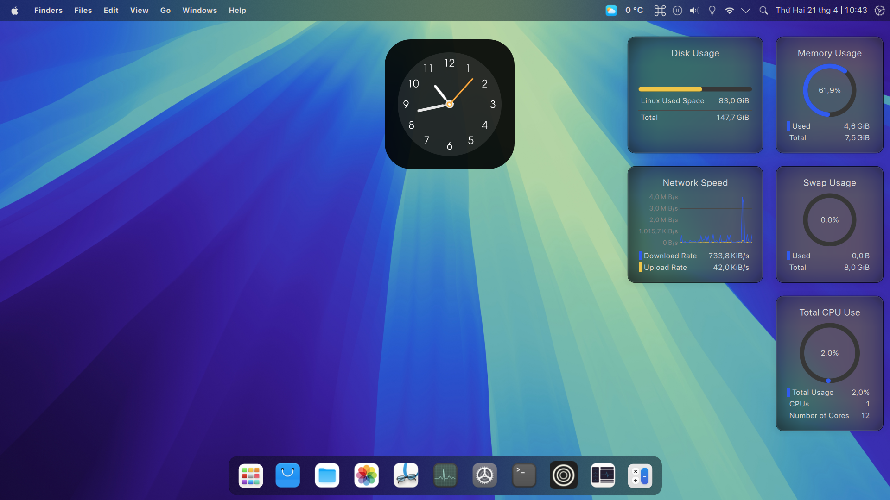

+++
title = "Cài KDE Plasma với theme macOS"
date = 2025-01-10
description = "Hướng dẫn cài đặt theme macOS cho KDE Plasma 6, bao gồm GTK, Kvantum, icon, cursor, Albert launcher, oh-my-posh cho Konsole, và Firefox theme."
[taxonomies]
tags = ["linux", "kde", "plasma", "macos-theme", "customization"]
[extra]
toc = true
+++

Hướng dẫn cài đặt **theme macOS** cho **KDE Plasma 6**, bao gồm GTK, Kvantum, icon, cursor, Albert launcher, oh-my-posh cho Konsole, và Firefox theme. Cảm ơn **LinuxScoop** đã hướng dẫn!

<!-- more -->

Tham khảo: [https://www.youtube.com/watch?v=tYIGBGyLGRs](https://www.youtube.com/watch?v=tYIGBGyLGRs)

## 1. Tải cấu hình

Vào [https://www.pling.com/p/2229017/](https://www.pling.com/p/2229017/) và tải tất cả các package.

## 2. Giải nén và cài đặt

Giả sử tất cả file đã tải nằm trong `~/Downloads`:

```bash
sudo apt install curl wget rsync git nautilus sassc kvantum
unzip -o $HOME/Downloads/plasma6macos-plasma-theme.zip -d $HOME/
unzip -o $HOME/Downloads/plasma6macos-gtk-theme-config.zip -d $HOME/
ln -sf $HOME/.config/gtk-4.0/gtk-Dark.css $HOME/.config/gtk-4.0/gtk.css
unzip -o $HOME/Downloads/plasma6macos-kvantum-config.zip -d $HOME/
unzip -o $HOME/Downloads/plasma6macos-icon-packs.zip -d $HOME/
unzip -o $HOME/Downloads/plasma6macos-cursors.zip -d $HOME/
unzip -o $HOME/Downloads/plasma6macos-font-packs.zip -d $HOME/
unzip -o $HOME/Downloads/plasma6macos-wallpaper-packs.zip -d $HOME/
unzip -o $HOME/Downloads/plasma6macos-plasmoids-widget.zip -d $HOME/
unzip -o $HOME/Downloads/plasma6macos-kwin-effect.zip -d $HOME/
```

Build **kwin-effects-forceblur**:

```bash
git clone https://github.com/taj-ny/kwin-effects-forceblur
cd kwin-effects-forceblur
mkdir build && cd build
cmake ../ -DCMAKE_INSTALL_PREFIX=/usr
make -j
sudo make install
```

Cấu hình hệ thống:

```bash
sudo unzip -o $HOME/Downloads/plasma6macos-sddm-config.zip -d /
sudo apt install plymouth
sudo unzip -o $HOME/Downloads/plasma6macos-plymouth-config.zip -d /
sudo update-alternatives --config default.plymouth  # Chọn MacOS
```

Cấu hình KDE:

```bash
kquitapp6 plasmashell
unzip -o $HOME/Downloads/plasma6macos-kde-config.zip -d $HOME
kstart plasmashell &> /dev/null &
```

Cài Albert Launcher:

```bash
sudo apt install ./albert_0.27.8-0+694.1_amd64.deb
unzip -o plasma6macos-albertlauncher-config.zip -d ~/
unzip -o plasma6macos-albertlauncher-theme.zip -d ~/
sudo unzip -o plasma6macos-albertlauncher-theme.zip -d /
```

Reboot là xong!

**Kết quả:**



## 3. Bonus

### ZSH và Oh-my-posh cho Konsole

```bash
sh -c "$(curl -fsSL https://raw.githubusercontent.com/ohmyzsh/ohmyzsh/master/tools/install.sh)"
git clone https://github.com/zsh-users/zsh-autosuggestions ~/.oh-my-zsh/custom/plugins/zsh-autosuggestions
git clone https://github.com/zsh-users/zsh-syntax-highlighting ~/.oh-my-zsh/custom/plugins/zsh-syntax-highlighting
git clone https://github.com/zsh-users/zsh-history-substring-search ~/.oh-my-zsh/custom/plugins/zsh-history-substring-search
curl -s https://ohmyposh.dev/install.sh | bash -s
sudo mv .local/bin/oh-my-posh /usr/local/bin
unzip -o ~/Downloads/plasma6macos-zshomh-config.zip -d $HOME
chmod u+rw $HOME/.poshthemes/*.json
unzip -o $HOME/Downloads/plasma6macos-konsole-profile.zip -d $HOME
```

### Firefox theme (tuỳ chọn)

```bash
git clone https://github.com/vinceliuice/WhiteSur-firefox-theme.git
cd WhiteSur-firefox-theme
./install.sh -m
```
